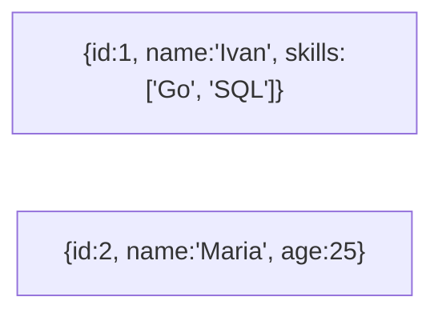

# 🍃 0. Введение в NoSQL

## 📑 Содержание
1. [Почему NoSQL?](#почему-nosql)
2. [Основные типы NoSQL](#основные-типы-nosql)
3. [ACID vs BASE](#acid-vs-base)
4. [CAP-теорема в NoSQL](#cap-теорема-в-nosql)

---

## 1. 🚀 Почему NoSQL?

**NoSQL = "Not Only SQL"** (Не только SQL).
Это ответ индустрии на проблемы классических RDBMS в 2000-х годах, когда появились **Big Data** и соцсети.

**Проблемы SQL баз, которые решали NoSQL:**
1.  **Жесткая схема**: В SQL сложно добавить новое поле "на лету" без простоя.
2.  **Масштабируемость**: SQL сложно "размазать" на 100 серверов (Sharding сложен).
3.  **Скорость**: SQL тратит много времени на ACID, блокировки и проверки.

**Философия NoSQL:**
"Давайте уберем лишние проверки, откажемся от сложных JOIN-ов и транзакций, но зато будем работать **очень быстро** и легко масштабироваться на тыcячи серверов".

---

## 2. 🗂️ Основные типы NoSQL

### 1. Key-Value (Ключ-Значение)
Самый простой тип. Как огромный `Map` илиDictionary.
*   **Пример**: **Redis**, Memcached.
*   **Суть**: Знаешь ключ — получаешь данные мгновенно (O(1)). Не знаешь ключ — не найдешь ничего.
*   **Use case**: Кеширование сессий, счетчики, корзина покупок.

### 2. Document-Oriented (Документные)
Хранят данные в виде JSON-документов.
*   **Пример**: **MongoDB**.
*   **Суть**: Похоже на строки в таблице, но каждая "строка" может иметь **свою структуру**. Можно вложенности, массивы.
*   **Use case**: Каталоги товаров (у каждого свои характеристики), профили пользователей, блоги.

### 3. Column-Family (Колоночные / Wide-Column)
Хранят данные не по строкам, а по колонкам.
*   **Пример**: **Cassandra**, HBase, ClickHouse (OLAP).
*   **Суть**: Супер-эффективно для чтения определенных колонок из огромного массива данных.
*   **Use case**: Аналитика, логи, Time-series данные, сообщения в мессенджерах (Discord использует ScyllaDB - клон Cassandra).

### 4. Graph (Графовые)
Хранят узлы и связи между ними.
*   **Пример**: **Neo4j**.
*   **Суть**: Эффективно для поиска связей "друзья друзей".
*   **Use case**: Соцсети, рекомендательные системы, антифрод.

---

## 3. ⚖️ ACID vs BASE

В мире NoSQL вместо строгой [ACID](../RDBMS/1.ACID.md) часто используют модель **BASE**:

*   **BA (Basically Available)**: Система отвечает на запросы (почти) всегда, но может иногда сбоить в части данных (см. CAP).
*   **S (Soft state)**: Состояние системы может меняться со временем само по себе (из-за репликации в фоне).
*   **E (Eventual consistency)**: **Согласованность в конечном счете**.
    *   Если вы поставили лайк, друг из Австралии может увидеть его не сразу, а через 2 секунды. Но *в конечном счете* все увидят лайк.

---

## 4. 🛡️ CAP-теорема в NoSQL

NoSQL базы данных чаще всего делают выбор в области CAP-теоремы (см. [RDBMS/2.Репликация_и_CAP](../RDBMS/2.Репликация_и_CAP.md)).

*   **RDBMS (Postgres, MySQL)** — обычно **CA** или **CP** (предпочитают консистентность).
*   **NoSQL (Cassandra, DynamoDB)** — часто **AP** (Availability).
    *   *Главное — принять запись*. Даже если часть кластера отвалилась, мы запишем данные на соседний узел. Конфликты разрулим потом при чтении.

> [!TIP]
> **Вывод**:
> Используйте **RDBMS** (Postgres) как основную базу по умолчанию.
> Используйте **NoSQL** (Redis, Mongo) только для специфических задач, где RDBMS не справляется или неудобна (кеш, гибкий документ, огромный поток логов).
