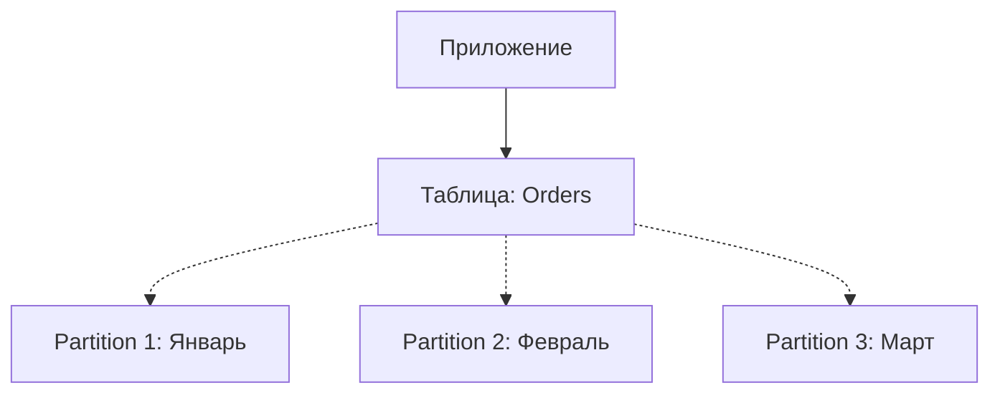

# 🍰 5. Партиционирование (Partitioning)

## 📑 Содержание
1. [Что это такое?](#1-что-это-такое)
2. [Партиционирование vs Шардирование](#2-партиционирование-vs-шардирование)
3. [Типы партиционирования](#3-типы-партиционирования)
4. [Зачем это нужно?](#4-зачем-это-нужно)

---

## 1. 🤔 Что это такое?

**Партиционирование** — это разделение одной большой таблицы (Parent Table) на несколько маленьких физических кусков (**партиций**).
При этом для приложения всё выглядит как одна таблица. СУБД сама понимает, в какой кусок положить данные или откуда прочитать.

> [!NOTE]
> Все партиции находятся **на одном сервере** (в отличие от Шардирования).



---

## 2. ⚔️ Партиционирование vs Шардирование

Многие путают эти понятия.

| Характеристика | Партиционирование | Шардирование |
| :--- | :--- | :--- |
| **Где живут данные?** | На **одном** сервере (в разных файлах). | На **разных** физических серверах. |
| **Цель** | Ускорить работу с *одной* машиной, удобство администрирования. | Масштабирование, когда одна машина *не справляется*. |
| **Сложность** | Низкая (поддерживается СУБД из коробки). | Высокая (нужен роутер, сложная логика). |

---

## 3. 🗂️ Типы партиционирования

В PostgreSQL (и других RDBMS) есть три основных стратегии:

### 1. By Range (По диапазону)
Самый популярный тип. Обычно используется для дат.
*   "Все заказы за Январь — в одну кучу, за Февраль — в другую".

```sql
CREATE TABLE orders (id int, date date) PARTITION BY RANGE (date);
CREATE TABLE orders_jan PARTITION OF orders FOR VALUES FROM ('2023-01-01') TO ('2023-02-01');
```

### 2. By List (По списку)
Группировка по конкретным значениям.
*   "Клиенты из Москвы и Питера — тут, остальные — там".
*   `PARTITION BY LIST (region)`: ('Moscow', 'SPb')

### 3. By Hash (По хешу)
Данные размазываются равномерно.
*   Используется, когда нет четкого критерия (даты или региона), но нужно разбить огромную таблицу на 4 части, чтобы они влезли в память.
*   `PARTITION BY HASH (id)`

---

## 4. 🚀 Зачем это нужно?

1.  **Скорость (Partition Pruning)**:
    *   Если вы делаете запрос `SELECT * FROM orders WHERE date = '2023-01-15'`, база данных **поймет**, что искать нужно только в патиции "Январь". Она даже не будет открывать файлы Февраля и Марта.
    *   Это работает быстрее индекса на гигантских объемах.
2.  **Удаление данных (Data Retention)**:
    *   Чтобы удалить данные за прошлый год из обычной таблицы, нужно сделать `DELETE`. Это тяжелая операция (блокировки, растет VACUUM).
    *   С партиционированием вы просто делаете `DROP TABLE orders_2022`. Это мгновенная операция удаления файла.
3.  **Обслуживание**:
    *   Можно делать `REINDEX` только "горячей" партиции (свежих данных), не трогая архив.

> [!TIP]
> Начинайте думать о партиционировании, когда таблица вырастает до **десятков миллионов строк** или **100+ ГБ**. До этого индексы справляются отлично.
