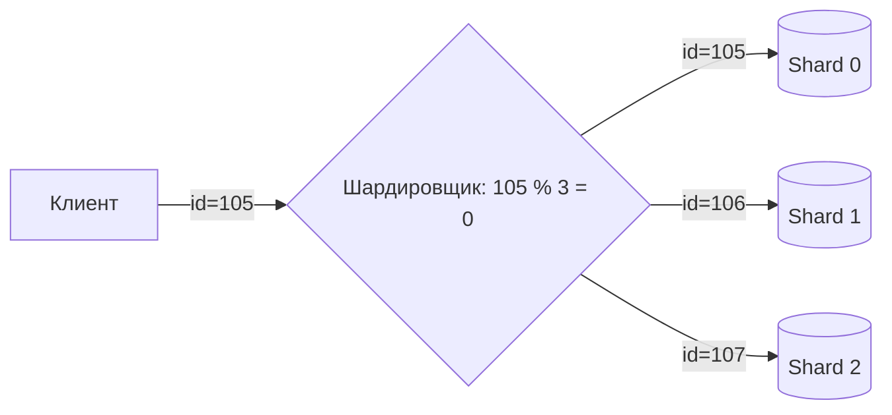

# 🔪 3. Шардирование (Sharding)

## 📑 Содержание
1. [Проблема масштабирования](#проблема-масштабирования)
2. [Горизонтальное vs Вертикальное](#горизонтальное-vs-вертикальное)
3. [Как работает Шардирование?](#как-работает-шардирование)
4. [Проблемы шардирования](#проблемы-шардирования)

---

## 1. 📈 Проблема масштабирования

Когда данных становится слишком много (терабайты) или запросов слишком много (100k RPS), одна машина (даже очень мощная) перестает справляться.

### Вертикальное масштабирование (Scale Up)
**"Купить сервер подороже"**.
Добавляем CPU, RAM, SSD в существующий сервер.
*   ✅ **Плюсы**: Не надо менять код приложения.
*   ❌ **Минусы**: Есть физический предел. Сервер с 100ТБ RAM стоит космических денег или просто не существует.

### Горизонтальное масштабирование (Scale Out)
**"Купить много дешевых серверов"**.
Распределяем данные по 10/100/1000 обычным машинам.
*   ✅ **Плюсы**: Бесконечный рост (просто добавь еще сервер).
*   ❌ **Минусы**: Сложность администрирования и кода.

---

## 2. 🧩 Что такое Шардирование?

**Шардирование (Sharding)** — это метод горизонтального масштабирования, при котором **одна логическая база данных** разделяется на несколько физических частей (**шардов/осколков**). Каждая часть (шард) живет на своем отдельном сервере.

> [!NOTE]
> **Шард** — это отдельная БД, хранящая *часть* данных. Все шарды вместе образуют полный набор данных.

---

## 3. ⚙️ Как это работает?

Нам нужен ключ (Shard Key), по которому мы будем решать, на какой сервер отправить данные.

### Пример: Шардирование по UserID

У нас 3 сервера (Шарда).
Приходит запрос: `GET /user?id=105`

1.  **Алгоритм**: `Shard_ID = User_ID % 3` (Остаток от деления)
2.  `105 % 3 = 0` -> Данные лежат на **Шарде 0**.

### Методы выбора шарда:
1.  **По диапазону (Range Based)**: ID 1-1000 -> Shard 1, 1001-2000 -> Shard 2.
    *   *Проблема*: Если все новые юзеры идут в конец, нагружается только последний шард.
2.  **Хэширование (Hash Based)**: `hash(id) % N`. Равномерное распределение.
3.  **Справочник (Directory Based)**: Отдельная таблица, где записано: "ID 1 -> Shard 5".

---

## 4. 🤯 Проблемы шардирования

Шардирование — это **крайняя мера**. Если можете не шардировать — не шардируйте.

1.  **Resharding (Перебалансировка)**:
    *   Было 3 сервера, стало тесно, купили 4-й.
    *   Формула `ID % 3` больше не работает. Нужно пересчитать ключи и перенести гигабайты данных с старых серверов на новый. Это очень больно и долго.
2.  **Cross-Shard JOINs**:
    *   Если `Users` на Шарде 1, а `Orders` на Шарде 2, вы не можете сделать `JOIN` одним SQL запросом.
    *   Приходится делать запросы к обоим шардам и склеивать данные в коде приложения.
3.  **Глобальные транзакции**:
    *   Сделать `COMMIT` сразу на двух разных серверах сложно (нужен протокол Two-Phase Commit, 2PC), и это очень медленно и ненадежно. Обычно от транзакций между шардами отказываются.

> [!IMPORTANT]
> **Вывод**: Шардирование усложняет архитектуру в 10 раз. Сначала оптимизируйте SQL, настройте индексы, кеширование и репликацию. Шардинг — когда другого выхода нет (как у Google, Facebook, Telegram).
