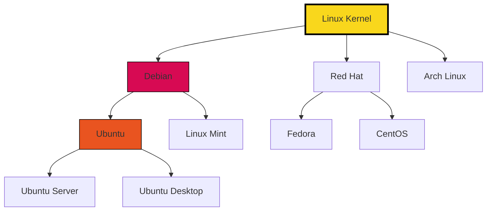
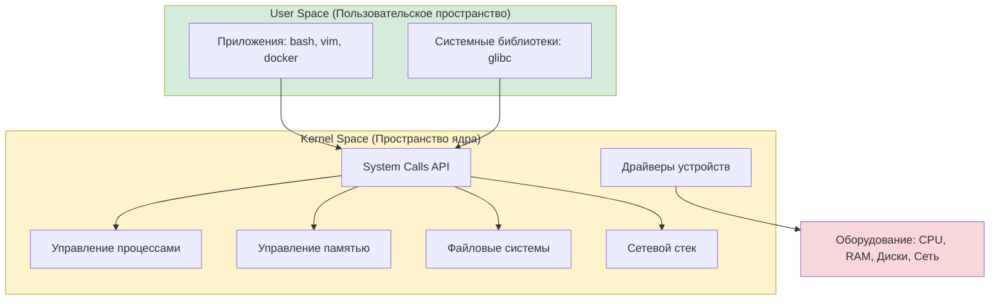
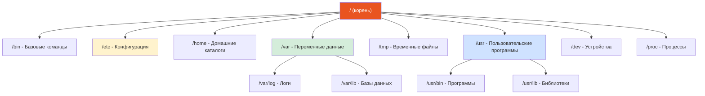
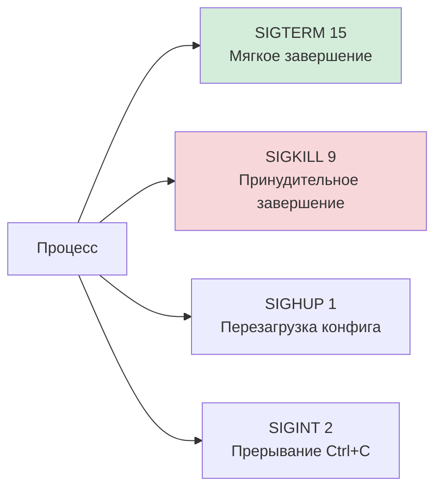
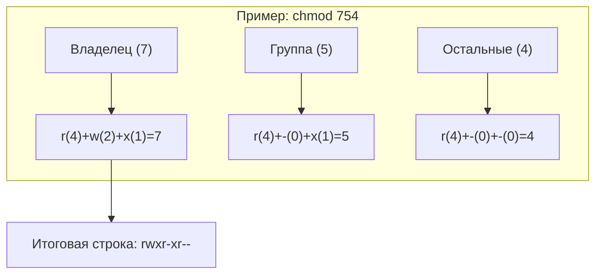

# 🐧 Linux: Основы работы с системой

## 📑 Содержание
1. [Введение в Linux](#1-введение-в-linux)
2. [Архитектура Linux](#2-архитектура-linux)
3. [Файловая система](#3-файловая-система)
4. [Управление файлами](#4-управление-файлами)
5. [Работа с текстом](#5-работа-с-текстом)
6. [Управление процессами](#6-управление-процессами)
7. [Права доступа](#7-права-доступа)
8. [Сетевые утилиты](#8-сетевые-утилиты)
9. [Управление пользователями](#9-управление-пользователями)
10. [Практические рецепты](#10-практические-рецепты)

---

## 1. 🏁 Введение в Linux

**Linux** — это семейство Unix-подобных операционных систем с открытым исходным кодом, основанных на ядре Linux.

### Ключевые особенности
- **Открытый исходный код**: Любой может изучать, модифицировать и распространять код
- **Многопользовательская система**: Поддержка множества пользователей одновременно
- **Многозадачность**: Параллельное выполнение множества процессов
- **Безопасность**: Продуманная система прав и изоляции процессов
- **Стабильность**: Работает месяцами и годами без перезагрузки

### Популярные дистрибутивы



> [!NOTE]
> **Ubuntu** и **Debian** наиболее популярны для серверов. **Fedora** и **Arch** — для разработчиков и энтузиастов.

---

## 2. 🏗️ Архитектура Linux

Linux состоит из нескольких уровней абстракции:



### Основные компоненты

| Компонент | Назначение |
|:---|:---|
| **Kernel** | Ядро системы, управляет ресурсами |
| **Shell** | Интерпретатор команд (bash, zsh) |
| **System Libraries** | Библиотеки для взаимодействия с ядром |
| **System Utilities** | Утилиты для администрирования |

---

## 3. 📂 Файловая система

В Linux все является файлом: устройства, процессы, сокеты.

### Структура каталогов



| Каталог | Описание |
|:---|:---|
| `/` | Корневая директория |
| `/bin` | Основные исполняемые файлы (ls, cp, mv) |
| `/sbin` | Системные команды для администратора |
| `/etc` | Конфигурационные файлы системы |
| `/home` | Домашние каталоги пользователей |
| `/root` | Домашний каталог суперпользователя |
| `/var` | Изменяемые данные (логи, почта, очереди) |
| `/tmp` | Временные файлы (очищаются при перезагрузке) |
| `/usr` | Установленные программы и библиотеки |
| `/dev` | Файлы устройств |
| `/proc` | Виртуальная ФС с информацией о процессах |
| `/sys` | Виртуальная ФС с информацией о системе |
| `/boot` | Файлы загрузчика и ядра |
| `/lib` | Системные библиотеки |
| `/opt` | Опциональное ПО |
| `/mnt` | Точки монтирования |
| `/media` | Съемные носители |

---

## 4. 📁 Управление файлами

### Основные команды

| Команда | Описание | Пример |
|:---|:---|:---|
| `ls` | Просмотр содержимого каталога | `ls -la` |
| `cd` | Смена каталога | `cd /home/user` |
| `pwd` | Текущий путь | `pwd` |
| `mkdir` | Создание каталога | `mkdir -p dir/subdir` |
| `touch` | Создание файла | `touch file.txt` |
| `cp` | Копирование | `cp -r source/ dest/` |
| `mv` | Перемещение/переименование | `mv old.txt new.txt` |
| `rm` | Удаление | `rm -rf directory/` |
| `cat` | Вывод содержимого | `cat file.txt` |
| `file` | Определение типа файла | `file archive.tar.gz` |
| `ln` | Создание ссылок | `ln -s /path/to/file link` |
| `find` | Поиск файлов | `find /home -name "*.log"` |
| `locate` | Быстрый поиск по базе | `locate nginx.conf` |
| `du` | Размер файлов/каталогов | `du -sh *` |
| `df` | Использование дисков | `df -h` |

> [!TIP]
> Опция `-h` (human-readable) делает вывод размеров более читаемым: `1.5G` вместо `1572864`.

### Работа с архивами

```bash
# Создание tar.gz архива
tar -czf archive.tar.gz directory/

# Извлечение
tar -xzf archive.tar.gz

# Просмотр содержимого без извлечения
tar -tzf archive.tar.gz
```

---

## 5. ✍️ Работа с текстом

### Утилиты для анализа текста

| Команда | Назначение | Пример |
|:---|:---|:---|
| `cat` | Вывод файла | `cat file.txt` |
| `less` | Постраничный просмотр | `less large.log` |
| `head` | Первые строки | `head -n 20 file.txt` |
| `tail` | Последние строки | `tail -f /var/log/syslog` |
| `grep` | Поиск по шаблону | `grep "error" app.log` |
| `sed` | Потоковое редактирование | `sed 's/old/new/g' file.txt` |
| `awk` | Обработка столбцов | `awk '{print $1}' data.txt` |
| `sort` | Сортировка | `sort -n numbers.txt` |
| `uniq` | Удаление дубликатов | `uniq -c sorted.txt` |
| `wc` | Подсчет строк/слов/байт | `wc -l file.txt` |
| `diff` | Сравнение файлов | `diff file1.txt file2.txt` |

### Мощные комбинации Pipeline

```bash
# Топ-10 IP адресов в логах Nginx
cat /var/log/nginx/access.log | cut -d' ' -f1 | sort | uniq -c | sort -rn | head -10

# Найти самые большие файлы
find / -type f -exec du -h {} + 2>/dev/null | sort -rh | head -20

# Количество процессов по пользователям
ps aux | awk '{print $1}' | sort | uniq -c | sort -rn
```

> [!NOTE]
> Оператор `|` (pipe) передает вывод одной команды на вход другой, позволяя строить мощные цепочки обработки.

---

## 6. ⚙️ Управление процессами

### Просмотр процессов

```bash
# Список всех процессов
ps aux

# Интерактивный мониторинг
top       # Классический
htop      # Улучшенная версия (требует установки)
```

### Сигналы и завершение процессов



| Команда | Описание | Пример |
|:---|:---|:---|
| `kill` | Отправка сигнала по PID | `kill -15 1234` |
| `killall` | Завершение по имени | `killall nginx` |
| `pkill` | Завершение по паттерну | `pkill -f "python.*script"` |
| `xkill` | Завершение по клику (GUI) | `xkill` |

> [!WARNING]
> `kill -9` (SIGKILL) не дает процессу времени на корректное завершение. Используйте только если `kill -15` не помог.

### Фоновые задачи

```bash
# Запуск в фоне
command &

# Отправка в фон (Ctrl+Z, затем)
bg

# Возврат на передний план
fg

# Список задач
jobs

# Запуск с отключением от терминала
nohup command &
```

---

## 7. 🔑 Права доступа

### Структура прав

В Linux права доступа — это набор атрибутов, определяющих, кто и что может делать с файлом или каталогом.

```text
- rwx r-x r--  1 user group 4096 Jan 30 12:00 file.txt
│ └┬┘ └┬┘ └┬┘
│  │   │   └─ Остальные (Others) — все остальные пользователи в системе
│  │   └───── Группа (Group) — пользователи, входящие в группу владельца
│  └───────── Владелец (Owner) — обычно создатель файла
└──────────── Тип файла (- обычный, d каталог, l ссылка)
```

### 🔢 Как считаются права (Логика и математика)

Каждое право имеет свой вес в двоичной (бинарной) и восьмеричной системах. Это важно для понимания команды `chmod`.

| Право | Символ | Двоичный вес | Десятичный вес | Описание |
|:---:|:---:|:---:|:---:|:---|
| **Read** | `r` | `100` | **4** | Чтение содержимого |
| **Write** | `w` | `010` | **2** | Изменение (запись) |
| **Execute** | `x` | `001` | **1** | Запуск файла / Поиск в каталоге |
| **None** | `-` | `000` | **0** | Нет прав |

#### Пошаговое вычисление одной группы прав:
Вы просто складываете веса активных прав. Как в детском конструкторе:

| Символы | Сложение | Итог | Описание |
|:---:|:---:|:---:|:---|
| `rwx` | 4 + 2 + 1 | **7** | Полный доступ (чтение, запись, выполнение) |
| `rw-` | 4 + 2 + 0 | **6** | Чтение и запись |
| `r-x` | 4 + 0 + 1 | **5** | Чтение и выполнение (часто для программ и папок) |
| `r--` | 4 + 0 + 0 | **4** | Только чтение |

### 🛠 Примеры расчета для всей строки

Чтобы получить трехзначное число для `chmod`, нужно посчитать сумму для каждой из трех групп: **Владелец - Группа - Остальные**.



**Популярные комбинации:**
- `chmod 777` — Вредный совет! Доступ открыт вообще всем.
- `chmod 755` — Классика для скриптов: владелец может всё, остальные — только читать и запускать.
- `chmod 644` — Стандарт для обычных файлов: владелец правит, остальные только читают.
- `chmod 600` — Конфиденциально: только владелец может читать и править (например, для ключей SSH).

### 📂 Особенности прав для КАТАЛОГОВ
Права для папок работают не так, как для файлов:
- **r (read)** — позволяет увидеть список файлов (`ls`).
- **w (write)** — позволяет создавать и удалять файлы в папке.
- **x (execute)** — позволяет «войти» в папку (`cd`) и получить доступ к файлам внутри.

> [!IMPORTANT]
> Если у вас есть `r`, но нет `x` на папку, вы увидите имена файлов через `ls`, но не сможете их прочитать или узнать их размер.

### 🔄 Команды изменения прав

```bash
# Восьмеричный формат (быстро и удобно)
chmod 755 script.sh    # rwxr-xr-x
chmod 644 file.txt     # rw-r--r--

# Символьный формат (когда нужно изменить только одно право)
chmod u+x script.sh    # User: добавить (+) выполнение (x)
chmod g-w file.txt     # Group: убрать (-) запись (w)
chmod o=r file.txt     # Others: установить только (=) чтение (r)
chmod a+r file.txt     # All: всем добавить чтение

# Массовое изменение (Рекурсивно)
chmod -R 755 my_project/
```

### Изменение владельца

```bash
# Сменить владельца
chown user file.txt

# Сменить владельца и группу
chown user:group file.txt

# Рекурсивно
chown -R user:group directory/
```

> [!IMPORTANT]
> Только суперпользователь (root) может изменять владельца файлов.

---

## 8. 🌐 Сетевые утилиты

### Основные команды

| Команда | Назначение | Пример |
|:---|:---|:---|
| `ip` | Управление сетью | `ip addr show` |
| `ping` | Проверка доступности | `ping -c 4 google.com` |
| `traceroute` | Трассировка маршрута | `traceroute google.com` |
| `netstat` | Сетевые соединения (устарела) | `netstat -tulpn` |
| `ss` | Сетевые сокеты (замена netstat) | `ss -tulpn` |
| `curl` | HTTP запросы | `curl -I https://api.com` |
| `wget` | Скачивание файлов | `wget https://file.tar.gz` |
| `nslookup` | DNS запросы | `nslookup google.com` |
| `dig` | Подробная DNS информация | `dig google.com` |
| `tcpdump` | Перехват пакетов | `tcpdump -i eth0 port 80` |

### Мониторинг сетевого трафика

```bash
# Показать процессы, использующие сеть
nethogs

# Статистика по интерфейсам
iftop
```

---

## 9. 👤 Управление пользователями

```bash
# Создание пользователя
useradd -m -s /bin/bash username

# Удаление пользователя
userdel -r username

# Изменение пользователя
usermod -aG sudo username    # Добавить в группу sudo

# Смена пароля
passwd username

# Переключение пользователя
su - username

# Выполнение от имени root
sudo command
```

### Конфигурационные файлы

| Файл | Описание |
|:---|:---|
| `/etc/passwd` | База пользователей |
| `/etc/shadow` | Зашифрованные пароли |
| `/etc/group` | Группы пользователей |
| `~/.bashrc` | Настройки оболочки пользователя |

---

## 10. 🍳 Практические рецепты

### Копирование между серверами

```bash
# Копирование файла на удаленный сервер
scp file.txt user@host:/path/to/destination

# Копирование каталога
scp -r directory/ user@host:/path/

# Копирование с сервера
scp user@host:/path/file.txt ./
```

### Мониторинг логов в реальном времени

```bash
# Следить за логом
tail -f /var/log/syslog

# С поиском по шаблону
tail -f app.log | grep ERROR

# Последние 100 строк с обновлением
tail -n 100 -f /var/log/nginx/access.log
```

### Топ IP адресов в логах

```bash
# Nginx access log
awk '{print $1}' /var/log/nginx/access.log | sort | uniq -c | sort -rn | head -10

# С использованием cut
cut -d' ' -f1 /var/log/nginx/access.log | sort | uniq -c | sort -rn | head -10
```

### Поиск файлов и выполнение команд

```bash
# Найти и удалить старые логи
find /var/log -name "*.log" -mtime +30 -delete

# Найти большие файлы (>100MB)
find / -type f -size +100M -exec ls -lh {} \; 2>/dev/null

# Изменить права для всех .sh файлов
find . -name "*.sh" -exec chmod +x {} \;
```

### Анализ использования диска

```bash
# Топ-10 самых больших каталогов
du -h / 2>/dev/null | sort -rh | head -10

# Размер каждого каталога в текущей директории
du -sh */ | sort -rh

# Использование дисков
df -h
```

### Работа с процессами

```bash
# Найти PID процесса по имени
pgrep nginx

# Полная информация о процессе
ps aux | grep nginx

# Убить все процессы python
pkill -f python

# Время работы процесса
ps -p PID -o etime=
```

---

## 🧪 Полезные переменные окружения

```bash
# Просмотр всех переменных
env

# Установка переменной
export VAR_NAME="value"

# Добавить в PATH
export PATH="$PATH:/new/path"

# Сделать постоянной (добавить в ~/.bashrc)
echo 'export VAR="value"' >> ~/.bashrc
source ~/.bashrc
```

---

## ⌨️ Горячие клавиши Bash

| Комбинация | Действие |
|:---|:---|
| `Ctrl+C` | Прервать команду |
| `Ctrl+Z` | Приостановить команду |
| `Ctrl+D` | Выход (EOF) |
| `Ctrl+L` | Очистить экран |
| `Ctrl+A` | В начало строки |
| `Ctrl+E` | В конец строки |
| `Ctrl+U` | Удалить от курсора до начала |
| `Ctrl+K` | Удалить от курсора до конца |
| `Ctrl+R` | Поиск по истории команд |
| `Tab` | Автодополнение |
| `!!` | Повторить последнюю команду |

---

> [!TIP]
> **Изучайте man-страницы**: `man <команда>` — лучший источник информации о любой команде Linux.

---

## 📚 Углубленные темы

Для более детального изучения отдельных подсистем Linux, обратитесь к следующим разделам:

1.  [**Файловая система и дескрипторы**](file:///Users/ilasgibadullin/Documents/develop/qwerty/data_structure:%20algorithms/go/%D0%B8%D0%BD%D1%84%D0%BE%D1%80%D0%BC%D0%B0%D1%82%D0%B8%D0%BA%D0%B0(%D1%82%D0%B5%D0%BE%D1%80%D0%B8%D1%8F)/linux/1.File_System.md) — философия «всё есть файл», Inodes, FD.
2.  [**Управление процессами**](file:///Users/ilasgibadullin/Documents/develop/qwerty/data_structure:%20algorithms/go/%D0%B8%D0%BD%D1%84%D0%BE%D1%80%D0%BC%D0%B0%D1%82%D0%B8%D0%BA%D0%B0(%D1%82%D0%B5%D0%BE%D1%80%D0%B8%D1%8F)/linux/2.Process_Management.md) — Fork, Exec, Сигналы.
3.  [**Управление памятью**](file:///Users/ilasgibadullin/Documents/develop/qwerty/data_structure:%20algorithms/go/%D0%B8%D0%BD%D1%84%D0%BE%D1%80%D0%BC%D0%B0%D1%82%D0%B8%D0%BA%D0%B0(%D1%82%D0%B5%D0%BE%D1%80%D0%B8%D1%8F)/linux/3.Memory_Management.md) — Виртуальная память, Swap, OOM Killer.
4.  [**Системные вызовы**](file:///Users/ilasgibadullin/Documents/develop/qwerty/data_structure:%20algorithms/go/%D0%B8%D0%BD%D1%84%D0%BE%D1%80%D0%BC%D0%B0%D1%82%D0%B8%D0%BA%D0%B0(%D1%82%D0%B5%D0%BE%D1%80%D0%B8%D1%8F)/linux/4.System_Calls.md) — Интерфейс взаимодействия с ядром.
5.  [**Сети и сокеты**](file:///Users/ilasgibadullin/Documents/develop/qwerty/data_structure:%20algorithms/go/%D0%B8%D0%BD%D1%84%D0%BE%D1%80%D0%BC%D0%B0%D1%82%D0%B8%D0%BA%D0%B0(%D1%82%D0%B5%D0%BE%D1%80%D0%B8%D1%8F)/linux/5.Networking.md) — Socket Descriptors, iptables.
6.  [**Shell Scripting**](file:///Users/ilasgibadullin/Documents/develop/qwerty/data_structure:%20algorithms/go/%D0%B8%D0%BD%D1%84%D0%BE%D1%80%D0%BC%D0%B0%D1%82%D0%B8%D0%BA%D0%B0(%D1%82%D0%B5%D0%BE%D1%80%D0%B8%D1%8F)/linux/6.Shell_Scripting.md) — Конвейеры и перенаправления.
7.  [**Cron Jobs**](file:///Users/ilasgibadullin/Documents/develop/qwerty/data_structure:%20algorithms/go/%D0%B8%D0%BD%D1%84%D0%BE%D1%80%D0%BC%D0%B0%D1%82%D0%B8%D0%BA%D0%B0(%D1%82%D0%B5%D0%BE%D1%80%D0%B8%D1%8F)/linux/7.Cron_Jobs.md) — Планировщик задач.

---

> [!CAUTION]
> Команды с `rm -rf /`, `dd`, форматирование дисков могут **безвозвратно уничтожить данные**. Всегда дважды проверяйте перед выполнением!