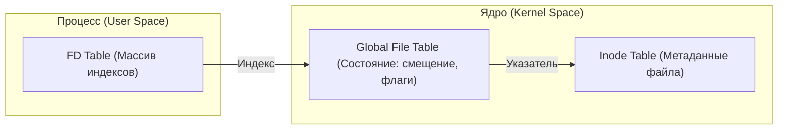

# 📂 File System & Descriptors (Файловая система и дескрипторы)

В Linux всё строится вокруг одной идеи: возможность работать с любым ресурсом как с последовательностью байтов.

---

## 1. 📄 Главная философия: Everything is a file

В Linux всё представлено в виде файлов:
- **Текстовые документы и бинарные файлы.**
- **Директории** (это файлы, содержащие список имен других файлов).
- **Устройства** (клавиатура, диски — `/dev/sda`).
- **Сокеты и пайпы** (средства связи между процессами).

---

## 2. 🏷 Inode (Индексный дескриптор)

**Inode** — это «паспорт» файла в файловой системе.
- Хранит: тип файла, права доступа, владельца, размер, время изменения и указатели на блоки данных на диске.
- **Не хранит**: Имя файла (оно хранится в файле-директории).
- Когда вы открываете файл `/home/user/test.txt`, система находит в директории `user` имя `test.txt` и узнает его номер Inode, по которому потом обращается к данным.

---

## 3. 🔍 Файловый дескриптор (FD) 🛠️

Если Inode — это описание файла на диске, то **File Descriptor** — это описание открытого файла в памяти процесса.

**FD** — это просто целое число (0, 1, 2, 3...), которое ядро выдает программе. Для процесса это «ручка», за которую он дергает, чтобы прочитать или записать данные.

### 🚩 Стандартные дескрипторы (у каждого процесса):
| FD | Имя | Куда смотрит по умолчанию |
|:---:|:---|:---|
| **0** | `stdin` | Клавиатура (ввод) |
| **1** | `stdout` | Терминал (вывод) |
| **2** | `stderr` | Терминал (ошибки) |

---

## 4. 🏗 Архитектура (Как это работает внутри) 🔬

Когда процесс запрашивает данные по FD, ядро проходит через три уровня:

1.  **Descriptor Table**: У каждого процесса своя. Хранит ссылки на общую таблицу.
2.  **Global File Table**: Общая для всей системы. Хранит текущую **позицию чтения/записи** (offset) и флаги (был ли файл открыт для чтения или записи).
3.  **Inode Table**: Описание физического объекта.

---

## 📚 Аналогия: Библиотека
Представьте, что **Ядро** — это библиотека.
1.  Вы (Процесс) просите книгу (открыть файл).
2.  Библиотекарь выдает вам **номер жетона** (FD = 3).
3.  Вы говорите: «Прочитай мне 10 страниц из книги номер 3».
4.  Библиотекарь помнит, что вы остановились на 50-й странице (это **offset** в Global File Table).
5.  Если ваш друг откроет ту же книгу, он получит **свой** жетон, и его 50-я страница не будет мешать вашей.

---

## 🛠 Полезные команды 🕹️
- `ls -l /proc/self/fd` — посмотреть дескрипторы текущего процесса.
- `lsof` — (list open files) вывести все открытые файлы в системе.
- `ulimit -n` — узнать лимит на количество открытых дескрипторов (обычно 1024).
