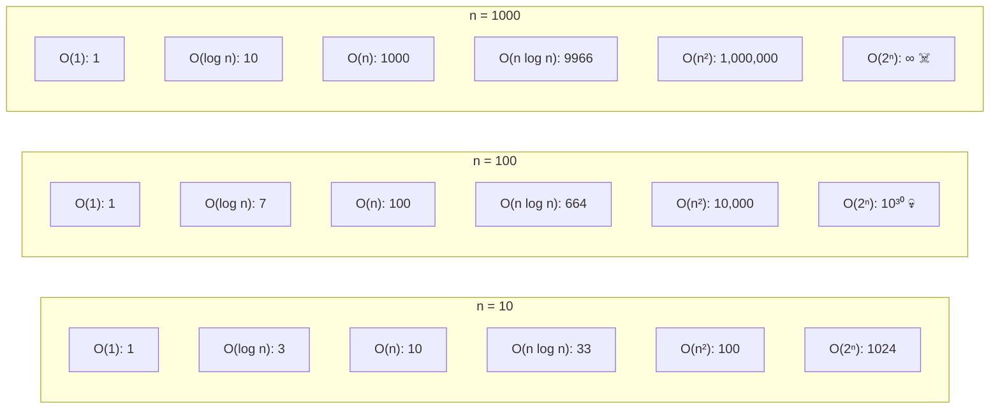

# 📈 Big O Notation (O-нотация)

## 📑 Содержание
1. [Что это и зачем?](#1-что-это-и-зачем)
2. [Классы сложности](#2-классы-сложности)
3. [Примеры кода на Go](#3-примеры-кода-на-go)
4. [Визуализация роста](#4-визуализация-роста)
5. [Space Complexity](#5-space-complexity)
6. [Другие нотации (Omega, Theta)](#6-другие-нотации-omega-theta)
7. [Как оптимизировать код](#7-как-оптимизировать-код)
8. [Шпаргалка](#8-шпаргалка)

---

## 1. 🤔 Что это и зачем?

**Big O** — это математическая нотация, описывающая, как меняется время выполнения алгоритма (или потребление памяти) при увеличении входных данных ($n$).

> [!IMPORTANT]
> Мы не считаем секунды. Мы считаем **количество операций**. Потому что секунды зависят от процессора, а количество операций — от алгоритма.

### Три случая

*   **Best Case** (лучший): Обычно не интересен (например, элемент найден сразу)
*   **Average Case** (средний): Важен для реальной оценки
*   **Worst Case** (худший) = **Big O**: Самый важный! "Хуже этого не будет"

> [!TIP]
> **Почему Worst Case?** Потому что в продакшене нужно быть готовым к худшему сценарию. Если алгоритм работает за O(n²) в худшем случае, то при большом n он может "упасть".

---

## 2. 🐢 Классы сложности (от лучшего к худшему)

### O(1) — Constant Time ⚡

Время **не зависит** от размера входных данных. Всегда одинаково быстро.

**Примеры:**
*   Взять элемент массива по индексу: `arr[5]`
*   Получить значение из HashMap: `m["key"]`
*   Добавить элемент в конец slice (если не нужно расширение): `append(slice, item)`

---

### O(log n) — Logarithmic Time 🚀

На каждом шаге отбрасываем **половину** данных. Очень эффективно!

**Примеры:**
*   Binary Search (бинарный поиск) в отсортированном массиве
*   Поиск в сбалансированном дереве (AVL, Red-Black Tree)
*   Операции в куче (heap)

> [!NOTE]
> $\log_2(1,000,000) \approx 20$. То есть для миллиона элементов нужно всего ~20 операций!

---

### O(n) — Linear Time 📏

Нужно пройти по всем элементам **1 раз**.

**Примеры:**
*   Найти максимум в массиве (нужно просмотреть все элементы)
*   Простой поиск элемента в неотсортированном массиве
*   Подсчет суммы элементов

---

### O(n log n) — Linearithmic Time ⚙️

Стандарт для **хороших** алгоритмов сортировки.

**Примеры:**
*   Merge Sort (сортировка слиянием)
*   Quick Sort (быстрая сортировка) — в среднем случае
*   Heap Sort

**Суть:** Мы делаем $n$ раз действие сложностью $\log n$.

---

### O(n²) — Quadratic Time 🐌

Вложенные циклы. Для каждого элемента проверяем все остальные.

**Примеры:**
*   Bubble Sort (сортировка пузырьком)
*   Selection Sort
*   Проверка всех пар элементов (например, найти дубликаты наивным способом)

> [!WARNING]
> При n = 10,000 получится 100,000,000 операций! Очень медленно для больших данных.

---

### O(2ⁿ) — Exponential Time 💣

Каждый новый элемент **удваивает** время работы. Катастрофа для больших n.

**Примеры:**
*   Рекурсивный расчет чисел Фибоначчи (без мemoization)
*   Перебор всех подмножеств множества
*   Решение задач полным перебором (brute force)

---

### O(n!) — Factorial Time ☠️

Хуже некуда. Практически нереально для n > 15.

**Примеры:**
*   Задача коммивояжера (Traveling Salesman Problem) — полный перебор
*   Генерация всех перестановок

> [!CAUTION]
> $10! = 3,628,800$, а $20! = 2.4 \times 10^{18}$ — это триллионы триллионов операций!

---

## 3. 💻 Примеры кода на Go

### O(1) — Константное время

```go
// Доступ к элементу массива
func getElement(arr []int, index int) int {
    return arr[index] // O(1)
}

// Вставка в HashMap
func insertToMap(m map[string]int, key string, value int) {
    m[key] = value // O(1) в среднем
}
```

---

### O(log n) — Логарифмическое время

```go
// Бинарный поиск в отсортированном массиве
func binarySearch(arr []int, target int) int {
    left, right := 0, len(arr)-1
    
    for left <= right {
        mid := left + (right-left)/2
        
        if arr[mid] == target {
            return mid // Нашли
        } else if arr[mid] < target {
            left = mid + 1 // Ищем в правой половине
        } else {
            right = mid - 1 // Ищем в левой половине
        }
    }
    
    return -1 // Не нашли
}
```

**Почему O(log n)?** Каждая итерация делит массив пополам. Для 1000 элементов нужно ~10 итераций ($\log_2(1000) \approx 10$).

---

### O(n) — Линейное время

```go
// Найти максимум в массиве
func findMax(arr []int) int {
    if len(arr) == 0 {
        return 0
    }
    
    max := arr[0]
    for _, num := range arr { // Проходим каждый элемент 1 раз
        if num > max {
            max = num
        }
    }
    return max
}

// Подсчет суммы
func sum(arr []int) int {
    total := 0
    for _, num := range arr { // O(n)
        total += num
    }
    return total
}
```

---

### O(n log n) — Линеаритмическое время

```go
// Merge Sort
func mergeSort(arr []int) []int {
    if len(arr) <= 1 {
        return arr
    }
    
    mid := len(arr) / 2
    left := mergeSort(arr[:mid])   // Рекурсия: log(n) уровней
    right := mergeSort(arr[mid:])
    
    return merge(left, right)      // Слияние: O(n)
}

func merge(left, right []int) []int {
    result := make([]int, 0, len(left)+len(right))
    i, j := 0, 0
    
    for i < len(left) && j < len(right) {
        if left[i] < right[j] {
            result = append(result, left[i])
            i++
        } else {
            result = append(result, right[j])
            j++
        }
    }
    
    result = append(result, left[i:]...)
    result = append(result, right[j:]...)
    return result
}
```

---

### O(n²) — Квадратичное время

```go
// Bubble Sort (сортировка пузырьком)
func bubbleSort(arr []int) {
    n := len(arr)
    
    for i := 0; i < n; i++ {           // Внешний цикл: n раз
        for j := 0; j < n-i-1; j++ {   // Внутренний цикл: n раз
            if arr[j] > arr[j+1] {
                arr[j], arr[j+1] = arr[j+1], arr[j] // Swap
            }
        }
    }
}

// Найти все пары с одинаковой суммой (наивный подход)
func findPairs(arr []int, target int) [][2]int {
    pairs := [][2]int{}
    
    for i := 0; i < len(arr); i++ {        // n итераций
        for j := i + 1; j < len(arr); j++ { // n итераций
            if arr[i]+arr[j] == target {
                pairs = append(pairs, [2]int{arr[i], arr[j]})
            }
        }
    }
    
    return pairs
}
```

---

### O(2ⁿ) — Экспоненциальное время

```go
// Фибоначчи (наивная рекурсия)
func fibonacci(n int) int {
    if n <= 1 {
        return n
    }
    // Каждый вызов порождает 2 новых вызова
    return fibonacci(n-1) + fibonacci(n-2) // O(2^n) - ПЛОХО!
}

// Улучшенная версия с мemoization - O(n)
func fibonacciMemo(n int, memo map[int]int) int {
    if n <= 1 {
        return n
    }
    
    if val, ok := memo[n]; ok {
        return val // Уже посчитали
    }
    
    memo[n] = fibonacciMemo(n-1, memo) + fibonacciMemo(n-2, memo)
    return memo[n]
}
```

---

## 4. 📊 Визуализация роста

Посмотрим, как растет время при увеличении n:



| n | O(1) | O(log n) | O(n) | O(n log n) | O(n²) | O(2ⁿ) |
|:---:|:---:|:---:|:---:|:---:|:---:|:---:|
| **10** | 1 | 3 | 10 | 33 | 100 | 1,024 |
| **100** | 1 | 7 | 100 | 664 | 10,000 | 10³⁰ 💀 |
| **1,000** | 1 | 10 | 1,000 | 9,966 | 1,000,000 | ∞ ☠️ |
| **10,000** | 1 | 13 | 10,000 | 132,877 | 100,000,000 | — |

---

## 5. 💾 Space Complexity

То же самое, но про **память**. Сколько **дополнительной** памяти нужно алгоритму?

### Примеры

```go
// O(1) Space - Константная память
func reverseInPlace(arr []int) {
    left, right := 0, len(arr)-1
    for left < right {
        arr[left], arr[right] = arr[right], arr[left]
        left++
        right--
    }
    // Только 2 переменные (left, right) независимо от n
}

// O(n) Space - Линейная память
func mergeSortExample(arr []int) []int {
    if len(arr) <= 1 {
        return arr
    }
    
    mid := len(arr) / 2
    left := mergeSort(arr[:mid])
    right := mergeSort(arr[mid:])
    
    // Создаем новый массив размером n
    return merge(left, right) // O(n) дополнительной памяти
}
```

> [!TIP]
> **In-place алгоритмы** (O(1) space) предпочтительнее, если память ограничена (например, на встроенных системах).

---

## 6. 📐 Другие нотации (Omega, Theta)

Big O — не единственная нотация! Есть и другие:

### Ω (Omega) — Нижняя граница

**Лучший случай**. Алгоритм не может работать **быстрее** этого.

*   **Пример**: Поиск минимума в неотсортированном массиве — **Ω(n)**, потому что нужно посмотреть все элементы хотя бы раз.

---

### Θ (Theta) — Точная граница

Алгоритм работает **ровно** с такой сложностью (и лучший, и худший случаи совпадают).

*   **Пример**: Подсчет суммы массива — **Θ(n)**, всегда проходим все n элементов.

---

### o (Little-o) — Строгая верхняя граница

Алгоритм работает **строго быстрее**, чем указанная функция.

*   **Пример**: O(n) также o(n²), потому что n растет медленнее n².

---

### Сравнение

| Нотация | Смысл | Пример |
|:---|:---|:---|
| **O (Big-O)** | Худший случай (≤) | "Не медленнее чем..." |
| **Ω (Omega)** | Лучший случай (≥) | "Не быстрее чем..." |
| **Θ (Theta)** | Точная оценка (=) | "Ровно..." |
| **o (Little-o)** | Строго меньше (<) | "Строго быстрее чем..." |

> [!NOTE]
> В 99% случаев используется **Big O**, потому что нас интересует худший случай.

---

## 7. 🛠️ Как оптимизировать код?

### Правила оптимизации

1. **Избегайте вложенных циклов** (O(n²)):
   ```go
   // ❌ ПЛОХО: O(n²)
   for i := 0; i < len(arr); i++ {
       for j := 0; j < len(arr); j++ {
           // ...
       }
   }
   
   // ✅ ХОРОШО: O(n) с HashMap
   seen := make(map[int]bool)
   for _, num := range arr {
       if seen[num] {
           // Нашли дубликат
       }
       seen[num] = true
   }
   ```

2. **Используйте правильные структуры данных**:
   - Быстрый поиск → HashMap (O(1))
   - Сортированные данные → Binary Search (O(log n))
   - Приоритеты → Heap (O(log n))

3. **Memoization для рекурсии**:
   ```go
   // Кешируем результаты, чтобы не пересчитывать
   memo := make(map[int]int)
   result := fibonacciMemo(50, memo) // O(n) вместо O(2^n)
   ```

4. **Ранний выход из цикла**:
   ```go
   // Если нашли - сразу выходим
   for _, num := range arr {
       if num == target {
           return true // Не продолжаем искать
       }
   }
   ```

---

## 8. 📝 Шпаргалка

| Сложность | Название | При увеличении n в 10 раз, время... | Применение |
|:---|:---|:---|:---|
| **O(1)** | Constant | Не меняется | HashMap, array access |
| **O(log n)** | Logarithmic | +константа (немного) | Binary Search, деревья |
| **O(n)** | Linear | ×10 | Простой поиск, сумма |
| **O(n log n)** | Linearithmic | ×10 (чуть больше) | Merge Sort, Quick Sort |
| **O(n²)** | Quadratic | ×100 | Bubble Sort, вложенные циклы |
| **O(2ⁿ)** | Exponential | 💀 Взрыв (10→1024) | Фибоначчи (наив), перебор |
| **O(n!)** | Factorial | ☠️ Катастрофа | Перестановки, TSP |

---

## 💡 Итоговые советы

1. **Всегда думайте о Big O** при написании кода
2. **O(n log n) — это хорошо** для сортировки
3. **O(n²) — плохо** для большого n
4. **O(2ⁿ) и O(n!) — катастрофа**, избегайте этого
5. **HashMap — ваш друг** для оптимизации O(n²) → O(n)
