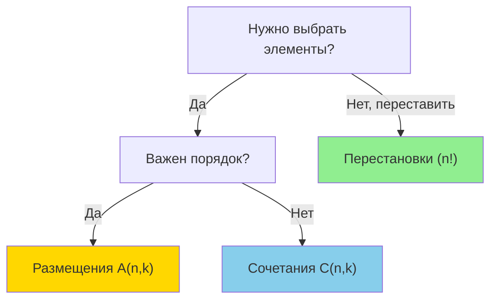

# 🎲 Combinatorics (Комбинаторика)

## 📑 Содержание
1. [Что это и зачем?](#1-что-это-и-зачем)
2. [Правила суммы и произведения](#2-правила-суммы-и-произведения)
3. [Перестановки (Permutations)](#3-перестановки-permutations)
4. [Сочетания (Combinations)](#4-сочетания-combinations)
5. [Размещения (Arrangements)](#5-размещения-arrangements)
6. [Реализация на Go](#6-реализация-на-go)
7. [Шпаргалка](#7-шпаргалка)

---

## 1. 🤔 Что это и зачем?

**Комбинаторика** — это раздел математики, который отвечает на вопрос: *"Сколькими способами можно...?"*.

Программисту это нужно для:
*   Оценки сложности алгоритмов (сколько вариантов перебирать?)
*   Криптографии (сколько ключей возможно?)
*   Тестирования (сколько тест-кейсов нужно покрыть?)
*   Решения задач на перебор

---

## 2. ➕ Правила суммы и произведения

Это фундамент всего.

### Правило суммы (OR)

Если мы можем выбрать элемент *А* **M** способами, **ИЛИ** элемент *B* **N** способами (и они не пересекаются), то выбрать *А* или *B* можно **M + N** способами.

*   *Пример*: У вас 3 рубашки и 2 футболки. Сколько вариантов "верха" можно надеть? $3 + 2 = 5$.

### Правило произведения (AND)

Если мы можем выбрать элемент *А* **M** способами, **И** после этого выбрать элемент *B* **N** способами, то пару (*А*, *B*) можно выбрать **M × N** способами.

*   *Пример*: У вас 3 рубашки и 2 штанов. Сколько комплектов одежды можно собрать? $3 \times 2 = 6$.

```go
// Пример: комбинации с PIN-кодом
func countPinCombinations(digits int) int {
    // Каждая позиция: 10 вариантов (0-9)
    // Правило произведения: 10 × 10 × 10 × ...
    result := 1
    for i := 0; i < digits; i++ {
        result *= 10
    }
    return result
}

func main() {
    fmt.Println(countPinCombinations(4)) // 10,000 вариантов для 4-значного PIN
    fmt.Println(countPinCombinations(6)) // 1,000,000 вариантов для 6-значного PIN
}
```

---

## 3. 🔄 Перестановки (Permutations)

Сколькими способами можно переставить $n$ объектов? Важен **порядок**.

Формула: $P_n = n!$ (эн факториал)

$n! = 1 \times 2 \times 3 \times ... \times n$

*   *Пример*: Сколькими способами можно расставить 3 книги на полке?
    $(ABC, ACB, BAC, BCA, CAB, CBA)$
    $3! = 3 \times 2 \times 1 = 6$.

> [!NOTE]
> **Факториал растет очень быстро!**
> $10! = 3,628,800$, а $13!$ уже переполняет 32-битный int.

### Реализация факториала на Go

```go
// Итеративная версия
func factorial(n int) int {
    if n < 0 {
        return 0
    }
    if n == 0 || n == 1 {
        return 1
    }
    
    result := 1
    for i := 2; i <= n; i++ {
        result *= i
    }
    return result
}

// Рекурсивная версия
func factorialRecursive(n int) int {
    if n <= 1 {
        return 1
    }
    return n * factorialRecursive(n-1)
}

func main() {
    fmt.Println(factorial(5))  // 120
    fmt.Println(factorial(10)) // 3,628,800
}
```

### Применение: генерация паролей

```go
// Сколько уникальных паролей из 8 символов (26 букв)?
// Без повторений: P(26, 8) = 26!/(26-8)! 
// С повторениями: 26^8 (правило произведения)

func passwordCombinations(alphabetSize, length int) int {
    result := 1
    for i := 0; i < length; i++ {
        result *= alphabetSize
    }
    return result
}

func main() {
    // Маленькие буквы (26) + большие (26) + цифры (10) = 62 символа
    combinations := passwordCombinations(62, 8)
    fmt.Printf("Возможных паролей из 8 символов: %d\n", combinations)
    // Вывод: 218,340,105,584,896 (218 триллионов!)
}
```

---

## 4. 🥣 Сочетания (Combinations)

Сколькими способами можно выбрать $k$ элементов из $n$? **Порядок НЕ важен**. Это как выбрать команду игроков: неважно, кого назвали первым, главное — кто попал в состав.

$$C_n^k = \binom{n}{k} = \frac{n!}{k!(n-k)!}$$

*   *Пример*: Выбрать 2 фрукта из 3 (Яблоко, Банан, Груша).
    Варианты: (Я,Б), (Я,Г), (Б,Г).
    $C_3^2 = \frac{3!}{2! \cdot 1!} = \frac{6}{2} = 3$.

### Свойства сочетаний

*   $C_n^0 = 1$ (один способ выбрать ничего)
*   $C_n^n = 1$ (один способ выбрать все)
*   $C_n^k = C_n^{n-k}$ (симметрия)

### Применение: лотерея

```go
// "5 из 36": выбрать 5 чисел из 36
// Вероятность выиграть = 1 / C(36, 5)

func combinations(n, k int) int {
    if k > n || k < 0 {
        return 0
    }
    if k == 0 || k == n {
        return 1
    }
    
    // C(n, k) = n! / (k! * (n-k)!)
    // Оптимизация: используем меньший k
    if k > n-k {
        k = n - k
    }
    
    result := 1
    for i := 0; i < k; i++ {
        result *= (n - i)
        result /= (i + 1)
    }
    
    return result
}

func main() {
    lottery := combinations(36, 5)
    fmt.Printf("Вариантов в лотерее '5 из 36': %d\n", lottery)
    fmt.Printf("Вероятность выиграть: 1/%d ≈ %.7f%%\n", lottery, 100.0/float64(lottery))
    // Вывод: 376,992 варианта, вероятность ≈ 0.0002652%
}
```

---

## 5. 📦 Размещения (Arrangements)

Сколькими способами можно выбрать $k$ элементов из $n$, если **Порядок ВАЖЕН**?

$$A_n^k = \frac{n!}{(n-k)!}$$

*   *Пример*: Выбрать 2 человек из 3 на должности "Главный" и "Зам".
    Варианты: (A,B), (B,A), (A,C), (C,A), (B,C), (C,B) — 6 вариантов.
    $A_3^2 = \frac{3!}{(3-2)!} = \frac{6}{1} = 6$.

**Разница с сочетаниями**: (A,B) и (B,A) — это **разные** размещения, но **одно** сочетание.

---

## 6. 💻 Реализация на Go

### Генерация всех перестановок

```go
func permute(nums []int) [][]int {
    result := [][]int{}
    
    var backtrack func(start int)
    backtrack = func(start int) {
        if start == len(nums) {
            // Копируем текущую перестановку
            perm := make([]int, len(nums))
            copy(perm, nums)
            result = append(result, perm)
            return
        }
        
        for i := start; i < len(nums); i++ {
            // Swap
            nums[start], nums[i] = nums[i], nums[start]
            backtrack(start + 1)
            // Swap back
            nums[start], nums[i] = nums[i], nums[start]
        }
    }
    
    backtrack(0)
    return result
}

func main() {
    nums := []int{1, 2, 3}
    perms := permute(nums)
    fmt.Println("Все перестановки [1,2,3]:")
    for _, perm := range perms {
        fmt.Println(perm)
    }
    // Вывод: [1 2 3], [1 3 2], [2 1 3], [2 3 1], [3 2 1], [3 1 2]
}
```

### Генерация всех сочетаний

```go
func combine(n, k int) [][]int {
    result := [][]int{}
    current := []int{}
    
    var backtrack func(start int)
    backtrack = func(start int) {
        if len(current) == k {
            // Копируем текущее сочетание
            comb := make([]int, k)
            copy(comb, current)
            result = append(result, comb)
            return
        }
        
        for i := start; i <= n; i++ {
            current = append(current, i)
            backtrack(i + 1)
            current = current[:len(current)-1] // Backtrack
        }
    }
    
    backtrack(1)
    return result
}

func main() {
    combs := combine(4, 2)
    fmt.Println("Все сочетания C(4,2):")
    for _, comb := range combs {
        fmt.Println(comb)
    }
    // Вывод: [1 2], [1 3], [1 4], [2 3], [2 4], [3 4]
}
```

---

## 7. 📝 Шпаргалка

| Тип | Порядок важен? | Используем все элементы? | Формула | Пример |
|---|:---:|:---:|---|---|
| **Перестановка** | ✅ Да | ✅ Да (все $n$) | $n!$ | Очередь людей (ABC, BAC...) |
| **Размещение** | ✅ Да | ❌ Нет (только $k$ из $n$) | $\frac{n!}{(n-k)!}$ | Пьедестал (1, 2, 3 место) |
| **Сочетание** | ❌ Нет | ❌ Нет (только $k$ из $n$) | $\frac{n!}{k!(n-k)!}$ | Выбор карт из колоды |

### Как выбрать?



---

## 💡 Применение в реальных задачах

### 1. Тестирование

```go
// Сколько тест-кейсов для проверки всех пар параметров?
// 3 браузера, 2 ОС, 4 языка
func testCases(browsers, os, languages int) int {
    return browsers * os * languages // Правило произведения
}

func main() {
    fmt.Println(testCases(3, 2, 4)) // 24 теста
}
```

### 2. Криптография

```go
// Сколько времени взломать 4-значный PIN перебором?
// 10,000 комбинаций
// При 1000 попыток/сек: 10 секунд
func bruteForceTime(combinations, attemptsPerSec int) float64 {
    return float64(combinations) / float64(attemptsPerSec)
}

func main() {
    time := bruteForceTime(10000, 1000)
    fmt.Printf("Время взлома PIN: %.1f секунд\n", time)
}
```

### 3. Игры и вероятности

```go
// Покер: вероятность получить royal flush
// C(4,1) способов выбрать масть
// C(52,5) всего комбинаций из 5 карт
func royalFlushProbability() float64 {
    suits := 4.0 // 4 масти
    totalHands := float64(combinations(52, 5)) // C(52,5)
    return suits / totalHands
}

func main() {
    prob := royalFlushProbability()
    fmt.Printf("Вероятность royal flush: %.10f (1 из %.0f)\n", 
               prob, 1.0/prob)
    // Вывод: ≈ 0.000001539 (1 из 649,740)
}
```

---

## 💡 Итог

| Задача | Формула | Go функция |
|:---|:---|:---|
| **Факториал** | $n!$ | `factorial(n)` |
| **Перестановки** | $n!$ | `permute(arr)` |
| **Сочетания** | $C_n^k$ | `combinations(n, k)` |
| **Размещения** | $A_n^k$ | `arrange(n, k)` |

> [!TIP]
> В Go нет встроенной функции факториала — реализуйте свою или используйте библиотеку `math/big` для больших чисел!
