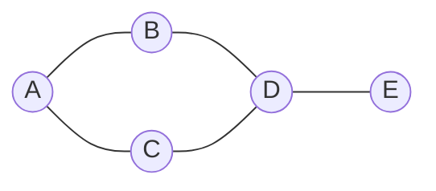
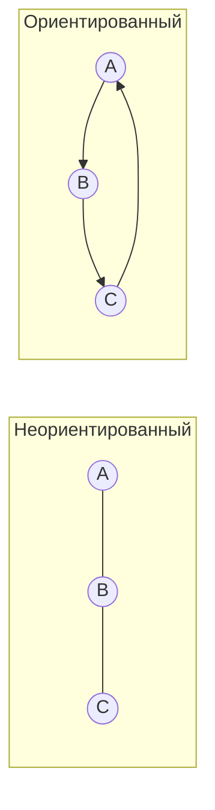

# 🕸 Graph Theory (Теория графов)

## 📑 Содержание
1. [Что такое граф?](#1-что-такое-граф)
2. [Виды графов](#2-виды-графов)
3. [Представление графов в коде](#3-представление-графов-в-коде)
4. [Обходы (BFS, DFS)](#4-обходы-bfs-dfs)
5. [Применение](#5-применение)

---

## 1. 📍 Что такое граф?

**Граф** — это структура данных, состоящая из **вершин** (nodes/vertices) и **ребер** (edges), которые их соединяют.

**Примеры из жизни:**
- Социальная сеть: вершины = люди, ребра = дружба
- Карта: вершины = города, ребра = дороги
- Интернет: вершины = сайты, ребра = ссылки



---

## 2. 🗂 Виды графов

### По направленности

- **Неориентированный граф**: Ребра без направления (дружба — взаимная)
- **Ориентированный (Directed)**: Стрелочки в одну сторону (подписка в Twitter — односторонняя)



### По наличию весов

- **Взвешенный (Weighted)**: У ребер есть вес (расстояние в км, стоимость)
- **Невзвешенный**: Все ребра одинаковые

### По связности

- **Связный**: Можно дойти от любой вершины к любой другой
- **Несвязный**: Есть изолированные компоненты

---

## 3. 💾 Представление графов в коде

Есть два основных способа:

### 1. Список смежности (Adjacency List) — Рекомендуется ✅

Для каждой вершины храним список ее соседей.

```go
type Graph struct {
    adjacencyList map[int][]int
}

func NewGraph() *Graph {
    return &Graph{
        adjacencyList: make(map[int][]int),
    }
}

func (g *Graph) AddEdge(from, to int) {
    g.adjacencyList[from] = append(g.adjacencyList[from], to)
    // Для неориентированного графа добавляем обратное ребро
    g.adjacencyList[to] = append(g.adjacencyList[to], from)
}

// Пример использования
func main() {
    graph := NewGraph()
    graph.AddEdge(1, 2)
    graph.AddEdge(1, 3)
    graph.AddEdge(2, 4)
    
    // adjacencyList:
    // 1 -> [2, 3]
    // 2 -> [1, 4]
    // 3 -> [1]
    // 4 -> [2]
}
```

**Плюсы:**
- Экономит память для разреженных графов (мало ребер)
- Быстро находить соседей вершины

**Минусы:**
- Медленно проверять, есть ли ребро между двумя вершинами: O(degree)

---

### 2. Матрица смежности (Adjacency Matrix)

2D массив, где `matrix[i][j] = 1`, если есть ребро из i в j.

```go
type GraphMatrix struct {
    matrix [][]int
    size   int
}

func NewGraphMatrix(size int) *GraphMatrix {
    matrix := make([][]int, size)
    for i := range matrix {
        matrix[i] = make([]int, size)
    }
    return &GraphMatrix{
        matrix: matrix,
        size:   size,
    }
}

func (g *GraphMatrix) AddEdge(from, to int) {
    g.matrix[from][to] = 1
    g.matrix[to][from] = 1 // Для неориентированного
}

func (g *GraphMatrix) HasEdge(from, to int) bool {
    return g.matrix[from][to] == 1
}
```

**Плюсы:**
- Очень быстро проверить наличие ребра: O(1)

**Минусы:**
- Всегда занимает O(V²) памяти, даже если ребер мало

---

## 4. 🚶‍♂️ Обходы (BFS, DFS)

### BFS (Breadth-First Search) — Поиск в ширину

Идем по графу **слоями**: сначала все соседи, потом соседи соседей.

**Использует очередь (Queue)**.

```go
func BFS(graph *Graph, start int) {
    visited := make(map[int]bool)
    queue := []int{start}
    visited[start] = true
    
    for len(queue) > 0 {
        // Извлекаем первый элемент
        node := queue[0]
        queue = queue[1:]
        
        fmt.Println("Посещаем:", node)
        
        // Добавляем всех соседей в очередь
        for _, neighbor := range graph.adjacencyList[node] {
            if !visited[neighbor] {
                visited[neighbor] = true
                queue = append(queue, neighbor)
            }
        }
    }
}
```

**Применение:**
- Поиск кратчайшего пути (в невзвешенном графе)
- Проверка связности графа
- Поиск компонент связности

**Сложность:** O(V + E) где V = вершины, E = ребра

---

### DFS (Depth-First Search) — Поиск в глубину

Идем **до упора** по одному пути, потом откатываемся и пробуем другие.

**Использует стек (Stack) или рекурсию**.

```go
func DFS(graph *Graph, start int, visited map[int]bool) {
    if visited == nil {
        visited = make(map[int]bool)
    }
    
    visited[start] = true
    fmt.Println("Посещаем:", start)
    
    for _, neighbor := range graph.adjacencyList[start] {
        if !visited[neighbor] {
            DFS(graph, neighbor, visited)
        }
    }
}

// Итеративная версия (с явным стеком)
func DFSIterative(graph *Graph, start int) {
    visited := make(map[int]bool)
    stack := []int{start}
    
    for len(stack) > 0 {
        // Извлекаем последний элемент
        node := stack[len(stack)-1]
        stack = stack[:len(stack)-1]
        
        if visited[node] {
            continue
        }
        
        visited[node] = true
        fmt.Println("Посещаем:", node)
        
        for _, neighbor := range graph.adjacencyList[node] {
            if !visited[neighbor] {
                stack = append(stack, neighbor)
            }
        }
    }
}
```

**Применение:**
- Поиск циклов
- Топологическая сортировка
- Поиск компонент сильной связности
- Решение лабиринтов

**Сложность:** O(V + E)

---

### Сравнение BFS и DFS

| Характеристика | BFS | DFS |
|:---|:---|:---|
| **Структура данных** | Очередь (Queue) | Стек (Stack) / Рекурсия |
| **Порядок обхода** | По уровням (слоям) | До упора по пути |
| **Кратчайший путь** | ✅ Находит | ❌ Не гарантирует |
| **Память** | O(V) | O(h) где h = глубина |
| **Применение** | Кратчайший путь, уровни | Циклы, топологическая сортировка |

---

## 5. 🎯 Применение

### Социальные сети

```go
// Найти всех друзей на расстоянии 2 шагов
func findFriendsOfFriends(graph *Graph, userID int) []int {
    friends := make(map[int]bool)
    visited := make(map[int]bool)
    queue := []int{userID}
    visited[userID] = true
    level := 0
    
    for len(queue) > 0 && level < 2 {
        size := len(queue)
        for i := 0; i < size; i++ {
            node := queue[0]
            queue = queue[1:]
            
            for _, neighbor := range graph.adjacencyList[node] {
                if !visited[neighbor] {
                    visited[neighbor] = true
                    queue = append(queue, neighbor)
                    if level == 1 {
                        friends[neighbor] = true
                    }
                }
            }
        }
        level++
    }
    
    result := []int{}
    for friend := range friends {
        result = append(result, friend)
    }
    return result
}
```

### Навигация (кратчайший путь)

BFS находит кратчайший путь в невзвешенном графе.

### Рекомендательные системы

Граф с вершинами пользователей и товаров, ребра = "купил товар".

---

## 💡 Итог

- **Граф** = вершины + ребра
- **Adjacency List** — лучше для разреженных графов
- **BFS** — кратчайший путь, обход по уровням
- **DFS** — циклы, топологическая сортировка, обход до упора
