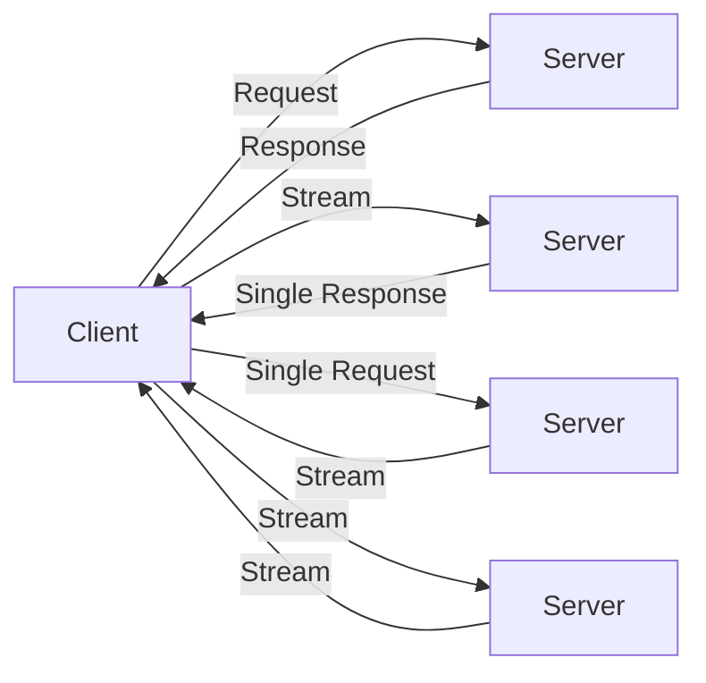

# 🚀 gRPC: Высокопроизводительный RPC от Google

## 📑 Содержание
1. [Почему gRPC?](#почему-grpc)
2. [Protocol Buffers (protobuf)](#protocol-buffers)
3. [Типы взаимодействия](#типы-взаимодействия)
4. [HTTP/2: Двигатель gRPC](#http2)
5. [Сравнение с REST](#сравнение-с-rest)

---

## ❓ Почему gRPC?

**gRPC (Remote Procedure Call)** — это фреймворк, который позволяет клиентскому приложению напрямую вызывать методы серверного приложения на другом компьютере, как если бы это был локальный объект.

В отличие от REST, который ориентирован на **ресурсы** (существительные: `/users`), gRPC ориентирован на **действия** (глаголы: `GetUser()`).

---

## 🛠️ Protocol Buffers (protobuf)

gRPC использует **Protobuf** как язык описания интерфейсов (IDL) и как формат сериализации.

> [!IMPORTANT]
> **Protobuf vs JSON:**
> - **JSON**: Текстовый, избыточный (ключи повторяются в каждом объекте), медленный парсинг.
> - **Protobuf**: Бинарный, строго типизированный, компактный. Ключи заменяются короткими номерами полей (tags).

**Пример .proto файла:**
```protobuf
syntax = "proto3";

service UserService {
  rpc GetUser (UserRequest) returns (UserResponse);
}

message UserRequest {
  string user_id = 1; // 1 — это тег поля в бинарном потоке
}

message UserResponse {
  string name = 1;
  int32 age = 2;
}
```

---

## 🔄 Типы взаимодействия

gRPC поддерживает 4 типа передачи данных:

1.  **Unary (Унарный)**: Один запрос — один ответ. Классика.
2.  **Server Streaming**: Клиент посылает запрос, сервер открывает поток и шлет пачку сообщений.
3.  **Client Streaming**: Клиент открывает поток и шлет пачку сообщений, сервер отвечает один раз.
4.  **Bidirectional Streaming**: Оба открывают потоки и обмениваются сообщениями в реальном времени.



---

## ⚡ HTTP/2: Двигатель gRPC

gRPC работает строго поверх **HTTP/2**. Это дает:
- **Мультиплексирование**: Можно слать много запросов параллельно в одном TCP-соединении.
- **Сжатие заголовков (HPACK)**: Заголовки HTTP очень тяжелые, HTTP/2 их сжимает.
- **Binary framing**: Данные передаются не текстом, а бинарными фреймами.

---

## ⚖️ Когда выбирать gRPC?

| Ситуация | Выбор | Почему? |
| :--- | :--- | :--- |
| **Внутренние микросервисы** | 🟢 gRPC | Максимальная скорость и строгая типизация. |
| **Публичное API / Web** | 🟡 REST | Легко использовать из любого браузера без прокси. |
| **Мобильные приложения** | 🟢 gRPC | Экономия батареи и трафика за счет бинарности. |
| **Real-time (Чаты, Игры)** | 🟢 gRPC | За счет двустороннего стриминга. |

---

> [!TIP]
> В Go gRPC является "родным" способом общения, так как большинство инструментов (например, Kubernetes) написаны на Go и используют gRPC под капотом. 🛡️
