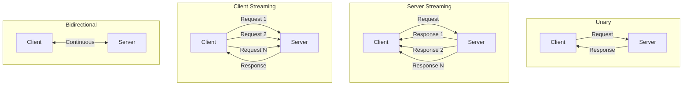
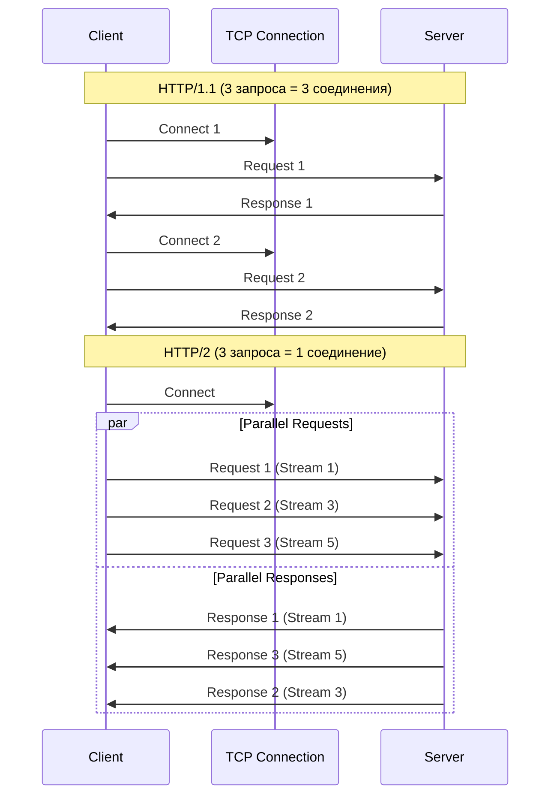

# 🚀 gRPC: Высокопроизводительный RPC от Google

## 📑 Содержание
1. [Почему gRPC?](#почему-grpc)
2. [Protocol Buffers (protobuf)](#protocol-buffers)
3. [Типы взаимодействия](#типы-взаимодействия)
4. [HTTP/2: Двигатель gRPC](#http2)
5. [Сравнение с REST](#сравнение-с-rest)
6. [Код генерация и workflow](#код-генерация)
7. [Metadata и Interceptors](#metadata-и-interceptors)
8. [Обработка ошибок](#обработка-ошибок)
9. [Load Balancing](#load-balancing)
10. [Безопасность и Аутентификация](#безопасность-и-аутентификация)
11. [Практические примеры на Go](#практические-примеры-на-go)
12. [Оптимизация производительности](#оптимизация-производительности)

---

## ❓ Почему gRPC?

**gRPC (Google Remote Procedure Call)** — это высокопроизводительный фреймворк RPC с открытым исходным кодом, который позволяет клиентскому приложению напрямую вызывать методы серверного приложения на другом компьютере, как если бы это был локальный объект.

### Ключевые преимущества:

- **Производительность**: Бинарный формат + HTTP/2 = до 7x быстрее REST
- **Строгая типизация**: Ошибки находятся на этапе компиляции
- **Кодогенерация**: Автоматическое создание клиентов и серверов
- **Bi-directional streaming**: Реальное время из коробки
- **Мультиязычность**: Одинаковый .proto файл для Go, Java, Python, C++

> [!NOTE]
> В отличие от REST, который ориентирован на **ресурсы** (существительные: `/users`), gRPC ориентирован на **действия** (глаголы: `GetUser()`).

---

## 🛠️ Protocol Buffers (protobuf)

gRPC использует **Protobuf** как язык описания интерфейсов (IDL) и как формат сериализации.

### Protobuf vs JSON: Детальное сравнение

| Характеристика | JSON | Protobuf |
|:---|:---|:---|
| **Формат** | Текстовый | Бинарный |
| **Размер** | ~100% | ~25-30% от JSON |
| **Скорость парсинга** | Медленно | В 3-10 раз быстрее |
| **Типизация** | Нет | Строгая |
| **Читаемость** | Высокая | Низкая (нужны инструменты) |
| **Обратная совместимость** | Сложно | Встроена |
| **Схема** | Опциональна | Обязательна |

> [!IMPORTANT]
> **Почему Protobuf компактнее?**
> - В JSON каждый ключ повторяется: `{"name": "John", "age": 30}` → 26 байт
> - В Protobuf ключи заменены числовыми тегами: `\x0A\x04John\x10\x1E` → 8 байт

### Расширенный пример .proto файла

```protobuf
syntax = "proto3";

package user;

option go_package = "github.com/myapp/proto/user";

// Импорт типов из других файлов
import "google/protobuf/timestamp.proto";
import "common/pagination.proto";

// Сервис описывает доступные RPC методы
service UserService {
  // Унарный вызов
  rpc GetUser (UserRequest) returns (UserResponse);
  
  // Server Streaming
  rpc ListUsers (ListUsersRequest) returns (stream UserResponse);
  
  // Client Streaming
  rpc UploadUserPhotos (stream PhotoChunk) returns (UploadResponse);
  
  // Bidirectional Streaming
  rpc Chat (stream ChatMessage) returns (stream ChatMessage);
}

// Message — это structure данных
message UserRequest {
  string user_id = 1;  // Тег 1 (не изменяется для совместимости)
  
  // optional — поле может отсутствовать (proto3)
  optional string fields_mask = 2;
}

message UserResponse {
  string id = 1;
  string username = 2;
  string email = 3;
  
  // Enum внутри message
  enum Status {
    UNKNOWN = 0;  // Всегда должен быть 0
    ACTIVE = 1;
    SUSPENDED = 2;
    DELETED = 3;
  }
  Status status = 4;
  
  // Вложенные объекты
  Address address = 5;
  
  // Repeated = массив
  repeated string tags = 6;
  
  // Map
  map<string, string> metadata = 7;
  
  // Timestamp из стандартной библиотеки
  google.protobuf.Timestamp created_at = 8;
}

message Address {
  string city = 1;
  string street = 2;
  int32 zip_code = 3;
}

message ListUsersRequest {
  common.Pagination pagination = 1;
  string filter = 2;
}
```

### Правила обратной совместимости

> [!WARNING]
> **Что НЕЛЬЗЯ делать:**
> - Менять номер тега существующего поля
> - Менять тип поля (string → int32)
> - Удалять `required` поля (в proto2)
>
> **Что МОЖНО:**
> - Добавлять новые поля (старые клиенты их проигнорируют)
> - Удалять необязательные поля (пометить как `reserved`)
> - Переименовывать поля (теги важнее имен)

---

## 🔄 Типы взаимодействия

gRPC поддерживает 4 типа передачи данных:

### 1. Unary RPC (Унарный)

**Сценарий**: Классический запрос-ответ (как REST).

```proto
rpc GetUser (UserRequest) returns (UserResponse);
```

**Go клиент:**
```go
ctx := context.Background()
resp, err := client.GetUser(ctx, &pb.UserRequest{UserId: "123"})
if err != nil {
    log.Fatalf("Error: %v", err)
}
fmt.Println(resp.Username)
```

---

### 2. Server Streaming

**Сценарий**: Скачивание большого объема данных частями, мониторинг логов в реальном времени.

```proto
rpc ListUsers (ListUsersRequest) returns (stream UserResponse);
```

**Go сервер:**
```go
func (s *server) ListUsers(req *pb.ListUsersRequest, stream pb.UserService_ListUsersServer) error {
    users := fetchUsersFromDB()
    
    for _, user := range users {
        if err := stream.Send(&pb.UserResponse{
            Id: user.ID,
            Username: user.Name,
        }); err != nil {
            return err
        }
        // Можно отправлять данные постепенно
        time.Sleep(100 * time.Millisecond)
    }
    return nil
}
```

**Go клиент:**
```go
stream, err := client.ListUsers(ctx, &pb.ListUsersRequest{})
if err != nil {
    log.Fatal(err)
}

for {
    user, err := stream.Recv()
    if err == io.EOF {
        break  // Поток закончился
    }
    if err != nil {
        log.Fatal(err)
    }
    fmt.Println("Received:", user.Username)
}
```

---

### 3. Client Streaming

**Сценарий**: Загрузка файла частями, отправка метрик батчами.

```proto
rpc UploadUserPhotos (stream PhotoChunk) returns (UploadResponse);
```

**Go клиент:**
```go
stream, err := client.UploadUserPhotos(ctx)
if err != nil {
    log.Fatal(err)
}

file, _ := os.Open("photo.jpg")
buffer := make([]byte, 64*1024)  // 64KB chunks

for {
    n, err := file.Read(buffer)
    if err == io.EOF {
        break
    }
    
    stream.Send(&pb.PhotoChunk{
        Data: buffer[:n],
    })
}

resp, err := stream.CloseAndRecv()
fmt.Println("Upload complete:", resp.Success)
```

---

### 4. Bidirectional Streaming

**Сценарий**: Чаты, онлайн-игры, коллаборативное редактирование.

```proto
rpc Chat (stream ChatMessage) returns (stream ChatMessage);
```

**Go сервер (эхо-чат):**
```go
func (s *server) Chat(stream pb.UserService_ChatServer) error {
    for {
        msg, err := stream.Recv()
        if err == io.EOF {
            return nil
        }
        if err != nil {
            return err
        }
        
        // Обработка и отправка обратно
        response := &pb.ChatMessage{
            User: "Bot",
            Text: "Echo: " + msg.Text,
        }
        
        if err := stream.Send(response); err != nil {
            return err
        }
    }
}
```



---

## ⚡ HTTP/2: Двигатель gRPC

gRPC работает строго поверх **HTTP/2**. Это дает:

### Ключевые фичи HTTP/2

1. **Мультиплексирование (Multiplexing)**
   - Множество запросов в **одном** TCP соединении
   - Нет блокировки (Head-of-Line Blocking как в HTTP/1.1)
   - Экономия на установке соединений

2. **Сжатие заголовков (HPACK)**
   - В HTTP/1.1 заголовки могут быть больше тела ответа
   - HPACK сжимает повторяющиеся заголовки
   - Экономия ~80% на заголовках

3. **Server Push**
   - Сервер может отправить данные до запроса
   - Используется редко в gRPC, но доступно

4. **Binary Framing**
   - Данные разбиваются на frames
   - Эффективная обработка на уровне ядра ОС



---

## ⚖️ Сравнение с REST: Детальная таблица

| Характеристика | REST | gRPC | Победитель |
|:---|:---|:---|:---:|
| **Протокол** | HTTP/1.1 (обычно) | HTTP/2 (обязательно) | gRPC |
| **Формат данных** | JSON, XML | Protobuf (binary) | gRPC |
| **Скорость** | Базовая | В 5-10 раз быстрее | gRPC |
| **Размер payload** | 100% | 20-30% от REST | gRPC |
| **Типизация** | Слабая (схемы опциональны) | Строгая (обязательная схема) | gRPC |
| **Streaming** | Нет (WebSocket отдельно) | 4 типа из коробки | gRPC |
| **Браузеры** | Нативная поддержка | Нужен gRPC-Web proxy | REST |
| **Кэширование** | HTTP cache (отлично) | Сложно | REST |
| **Читаемость** | cURL, постман | Нужны спец. инструменты | REST |
| **Документация** | Swagger, OpenAPI | .proto файлы | Равно |
| **Код-генерация** | Опционально | Обязательно | gRPC |
| **Load Balancing** | L7 балансировка сложна | Встроенная клиентская | gRPC |
| **Deadline/Timeout** | Вручную | Встроено | gRPC |
| **Ошибки** | HTTP коды | Rich error codes + details | gRPC |

### Когда выбирать что?

| Сценарий | Рекомендация | Обоснование |
|:---|:---:|:---|
| **Микросервисы (internal)** | 🟢 gRPC | Скорость, типизация, streaming |
| **Публичное API для веба** | 🟡 REST | Простота, браузеры, кэширование |
| **Мобильные приложения** | 🟢 gRPC | Экономия батареи и трафика |
| **IoT устройства** | 🟢 gRPC | Компактность, low overhead |
| **Real-time (чаты, игры)** | 🟢 gRPC | Bidirectional streaming |
| **CRUD операции** | 🟡 REST | Простота, стандартизация |
| **Загрузка больших файлов** | 🟢 gRPC | Client streaming |
| **Интеграция с legacy** | 🟡 REST | Широкая совместимость |

---

## 🔧 Код генерация и workflow

### Установка инструментов (Go)

```bash
# Protocol Buffers компилятор
brew install protobuf

# Go плагин для protoc
go install google.golang.org/protobuf/cmd/protoc-gen-go@latest
go install google.golang.org/grpc/cmd/protoc-gen-go-grpc@latest
```

### Структура проекта

```
project/
├── proto/
│   └── user/
│       └── user.proto          # Схемы
├── internal/
│   └── generated/
│       └── user/
│           ├── user.pb.go      # Сгенерированные типы
│           └── user_grpc.pb.go # Сгенерированный сервер/клиент
├── cmd/
│   ├── server/
│   │   └── main.go
│   └── client/
│       └── main.go
└── Makefile
```

### Makefile для генерации

```makefile
.PHONY: proto
proto:
	protoc --go_out=./internal/generated \
	       --go_opt=paths=source_relative \
	       --go-grpc_out=./internal/generated \
	       --go-grpc_opt=paths=source_relative \
	       proto/user/*.proto
```

---

## 🏷️ Metadata и Interceptors

### Metadata (аналог HTTP headers)

**Отправка metadata с клиента:**
```go
md := metadata.Pairs(
    "authorization", "Bearer token123",
    "request-id", uuid.New().String(),
)
ctx := metadata.NewOutgoingContext(context.Background(), md)

resp, err := client.GetUser(ctx, &pb.UserRequest{UserId: "123"})
```

**Чтение metadata на сервере:**
```go
func (s *server) GetUser(ctx context.Context, req *pb.UserRequest) (*pb.UserResponse, error) {
    md, ok := metadata.FromIncomingContext(ctx)
    if !ok {
        return nil, status.Error(codes.Unauthenticated, "no metadata")
    }
    
    token := md.Get("authorization")
    if len(token) == 0 {
        return nil, status.Error(codes.Unauthenticated, "no token")
    }
    
    // Валидация токена...
    return &pb.UserResponse{...}, nil
}
```

### Interceptors (middleware)

**Унарный interceptor (логирование):**
```go
func loggingInterceptor(
    ctx context.Context,
    req interface{},
    info *grpc.UnaryServerInfo,
    handler grpc.UnaryHandler,
) (interface{}, error) {
    start := time.Now()
    
    // Вызов настоящего handler
    resp, err := handler(ctx, req)
    
    log.Printf("Method: %s, Duration: %v, Error: %v",
        info.FullMethod,
        time.Since(start),
        err,
    )
    
    return resp, err
}

// Подключение
grpcServer := grpc.NewServer(
    grpc.UnaryInterceptor(loggingInterceptor),
)
```

**Stream interceptor:**
```go
func streamLoggingInterceptor(
    srv interface{},
    ss grpc.ServerStream,
    info *grpc.StreamServerInfo,
    handler grpc.StreamHandler,
) error {
    log.Printf("Stream started: %s", info.FullMethod)
    err := handler(srv, ss)
    log.Printf("Stream ended: %s, Error: %v", info.FullMethod, err)
    return err
}
```

---

## ❌ Обработка ошибок

gRPC использует **статусные коды** (не HTTP коды!).

### Основные коды

```go
import "google.golang.org/grpc/codes"

codes.OK              // Успех
codes.Canceled        // Клиент отменил запрос
codes.InvalidArgument // Невалидные данные
codes.NotFound        // Ресурс не найден
codes.AlreadyExists   // Конфликт
codes.PermissionDenied // Нет прав
codes.Unauthenticated // Не авторизован
codes.ResourceExhausted // Rate limit
codes.Internal        // Внутренняя ошибка
codes.Unavailable     // Сервис недоступен
codes.DeadlineExceeded // Таймаут
```

### Возврат ошибки с деталями

```go
import (
    "google.golang.org/grpc/status"
    "google.golang.org/genproto/googleapis/rpc/errdetails"
)

func (s *server) GetUser(ctx context.Context, req *pb.UserRequest) (*pb.UserResponse, error) {
    if req.UserId == "" {
        st := status.New(codes.InvalidArgument, "user_id is required")
        
        // Добавление деталей
        v := &errdetails.BadRequest_FieldViolation{
            Field: "user_id",
            Description: "must not be empty",
        }
        br := &errdetails.BadRequest{}
        br.FieldViolations = append(br.FieldViolations, v)
        
        st, _ = st.WithDetails(br)
        return nil, st.Err()
    }
    
    // ...
}
```

**Обработка на клиенте:**
```go
resp, err := client.GetUser(ctx, req)
if err != nil {
    st := status.Convert(err)
    
    fmt.Println("Code:", st.Code())
    fmt.Println("Message:", st.Message())
    
    for _, detail := range st.Details() {
        switch t := detail.(type) {
        case *errdetails.BadRequest:
            for _, violation := range t.FieldViolations {
                fmt.Printf("Field: %s, Error: %s\n", violation.Field, violation.Description)
            }
        }
    }
}
```

---

## ⚖️ Load Balancing

gRPC поддерживает **client-side load balancing**.

### Типы балансировки

```go
import "google.golang.org/grpc/balancer/roundrobin"

// Round Robin
conn, err := grpc.Dial(
    "dns:///myservice.example.com",  // DNS с несколькими A-записями
    grpc.WithDefaultServiceConfig(`{"loadBalancingPolicy":"round_robin"}`),
    grpc.WithInsecure(),
)

// Pick First (default)
conn, err := grpc.Dial(
    "myservice:50051",
    grpc.WithInsecure(),
)
```

### Service Discovery с Kubernetes

```yaml
apiVersion: v1
kind: Service
metadata:
  name: user-service
spec:
  clusterIP: None  # Headless service
  selector:
    app: user
  ports:
  - port: 50051
```

```go
// В Go клиенте
conn, err := grpc.Dial(
    "dns:///user-service.default.svc.cluster.local:50051",
    grpc.WithDefaultServiceConfig(`{"loadBalancingPolicy":"round_robin"}`),
)
```

---

## 🔒 Безопасность и Аутентификация

### 1. TLS (Transport Layer Security)

**Сервер с TLS:**
```go
creds, err := credentials.NewServerTLSFromFile("server.crt", "server.key")
if err != nil {
    log.Fatal(err)
}

grpcServer := grpc.NewServer(grpc.Creds(creds))
```

**Клиент с TLS:**
```go
creds, err := credentials.NewClientTLSFromFile("ca.crt", "myservice.com")
conn, err := grpc.Dial("myservice.com:443", grpc.WithTransportCredentials(creds))
```

### 2. Token-based Authentication

**Клиент отправляет токен:**
```go
type tokenAuth struct {
    token string
}

func (t tokenAuth) GetRequestMetadata(ctx context.Context, uri ...string) (map[string]string, error) {
    return map[string]string{
        "authorization": "Bearer " + t.token,
    }, nil
}

func (t tokenAuth) RequireTransportSecurity() bool {
    return true  // Только через TLS
}

conn, err := grpc.Dial(
    "myservice.com:443",
    grpc.WithPerRPCCredentials(tokenAuth{token: "jwt_token"}),
)
```

**Сервер валидирует токен:**
```go
func authInterceptor(ctx context.Context, req interface{}, info *grpc.UnaryServerInfo, handler grpc.UnaryHandler) (interface{}, error) {
    md, ok := metadata.FromIncomingContext(ctx)
    if !ok {
        return nil, status.Error(codes.Unauthenticated, "missing metadata")
    }
    
    authHeader := md.Get("authorization")
    if len(authHeader) == 0 {
        return nil, status.Error(codes.Unauthenticated, "missing token")
    }
    
    token := strings.TrimPrefix(authHeader[0], "Bearer ")
    
    // Валидация JWT
    claims, err := validateJWT(token)
    if err != nil {
        return nil, status.Error(codes.Unauthenticated, "invalid token")
    }
    
    // Добавляем user в контекст
    ctx = context.WithValue(ctx, "user", claims)
    
    return handler(ctx, req)
}
```

### 3. Mutual TLS (mTLS)

**Сервер требует клиентский сертификат:**
```go
cert, err := tls.LoadX509KeyPair("server.crt", "server.key")
certPool := x509.NewCertPool()
ca, _ := os.ReadFile("ca.crt")
certPool.AppendCertsFromPEM(ca)

creds := credentials.NewTLS(&tls.Config{
    Certificates: []tls.Certificate{cert},
    ClientAuth:   tls.RequireAndVerifyClientCert,
    ClientCAs:    certPool,
})

grpcServer := grpc.NewServer(grpc.Creds(creds))
```

---

## 💻 Практические примеры на Go

### Полный пример сервера

```go
package main

import (
    "context"
    "log"
    "net"
    
    pb "myapp/internal/generated/user"
    "google.golang.org/grpc"
    "google.golang.org/grpc/codes"
    "google.golang.org/grpc/status"
)

type userServer struct {
    pb.UnimplementedUserServiceServer
}

func (s *userServer) GetUser(ctx context.Context, req *pb.UserRequest) (*pb.UserResponse, error) {
    // Проверка deadline
    if ctx.Err() == context.DeadlineExceeded {
        return nil, status.Error(codes.DeadlineExceeded, "request timeout")
    }
    
    // Бизнес логика
    if req.UserId == "" {
        return nil, status.Error(codes.InvalidArgument, "user_id required")
    }
    
    // Имитация БД
    user := &pb.UserResponse{
        Id:       req.UserId,
        Username: "john_doe",
        Email:    "john@example.com",
        Status:   pb.UserResponse_ACTIVE,
    }
    
    return user, nil
}

func main() {
    lis, err := net.Listen("tcp", ":50051")
    if err != nil {
        log.Fatalf("Failed to listen: %v", err)
    }
    
    grpcServer := grpc.NewServer(
        grpc.UnaryInterceptor(loggingInterceptor),
    )
    
    pb.RegisterUserServiceServer(grpcServer, &userServer{})
    
    log.Println("Server listening on :50051")
    if err := grpcServer.Serve(lis); err != nil {
        log.Fatalf("Failed to serve: %v", err)
    }
}
```

### Полный пример клиента

```go
package main

import (
    "context"
    "log"
    "time"
    
    pb "myapp/internal/generated/user"
    "google.golang.org/grpc"
    "google.golang.org/grpc/credentials/insecure"
)

func main() {
    conn, err := grpc.Dial(
        "localhost:50051",
        grpc.WithTransportCredentials(insecure.NewCredentials()),
        grpc.WithBlock(),  // Ждать подключения
    )
    if err != nil {
        log.Fatalf("Connection failed: %v", err)
    }
    defer conn.Close()
    
    client := pb.NewUserServiceClient(conn)
    
    // Контекст с таймаутом
    ctx, cancel := context.WithTimeout(context.Background(), 5*time.Second)
    defer cancel()
    
    resp, err := client.GetUser(ctx, &pb.UserRequest{
        UserId: "123",
    })
    
    if err != nil {
        log.Fatalf("Error: %v", err)
    }
    
    log.Printf("User: %s (%s)", resp.Username, resp.Email)
}
```

---

## ⚡ Оптимизация производительности

### 1. Connection Pooling

```go
// Переиспользуем одно соединение
var (
    conn   *grpc.ClientConn
    client pb.UserServiceClient
)

func init() {
    var err error
    conn, err = grpc.Dial("localhost:50051", grpc.WithInsecure())
    if err != nil {
        log.Fatal(err)
    }
    client = pb.NewUserServiceClient(conn)
}

// Используем в разных горутинах
func makeRequest() {
    resp, _ := client.GetUser(context.Background(), &pb.UserRequest{})
    // ...
}
```

### 2. Batching запросов

```proto
// Вместо N запросов GetUser
rpc GetUsers (GetUsersRequest) returns (GetUsersResponse);

message GetUsersRequest {
  repeated string user_ids = 1;
}

message GetUsersResponse {
  repeated UserResponse users = 1;
}
```

### 3. Компрессия

```go
import "google.golang.org/grpc/encoding/gzip"

// Сервер
grpcServer := grpc.NewServer()

// Клиент
conn, _ := grpc.Dial(
    "localhost:50051",
    grpc.WithDefaultCallOptions(grpc.UseCompressor(gzip.Name)),
)
```

### 4. Оптимизация Protobuf

```proto
// ❌ Плохо: строки для чисел
message BadUser {
  string id = 1;  // "12345"
  string age = 2; // "30"
}

// ✅ Хорошо: правильные типы
message GoodUser {
  int64 id = 1;   // Компактнее
  int32 age = 2;
}
```

### 5. Keep-Alive настройки

```go
var kacp = keepalive.ClientParameters{
    Time:                10 * time.Second, // Пинг каждые 10 сек
    Timeout:             3 * time.Second,  // Ждем ответ 3 сек
    PermitWithoutStream: true,             // Пинг даже без активных стримов
}

conn, _ := grpc.Dial(
    "localhost:50051",
    grpc.WithKeepaliveParams(kacp),
)
```

---

## 🎯 Real-world Use Cases

### 1. Kubernetes API Server
- Все компоненты K8s общаются через gRPC
- Streaming для watch операций
- Высокая производительность

### 2. Netflix
- Внутренняя коммуникация микросервисов
- 2+ миллиарда gRPC запросов в день
- Замена REST на gRPC снизила latency на 50%

### 3. Google Cloud APIs
- Все новые API (Cloud Spanner, Pub/Sub) используют gRPC
- gRPC-Web для браузеров
- Авто-генерация клиентов на 10+ языках

### 4. Uber
- Real-time локация водителей (bidirectional streaming)
- Микросервисная архитектура на gRPC
- Свой фреймворк TChannel → gRPC миграция

---

> [!TIP]
> **Золотое правило:**
> - **Internal services** (микросервисы) → gRPC
> - **External API** (публичное для браузеров) → REST или gRPC-Web
> - **Real-time features** → gRPC streaming
> - **Legacy integration** → REST
>
> В Go gRPC является "родным" способом общения, так как большинство инструментов (например, Kubernetes) написаны на Go и используют gRPC под капотом. 🛡️
