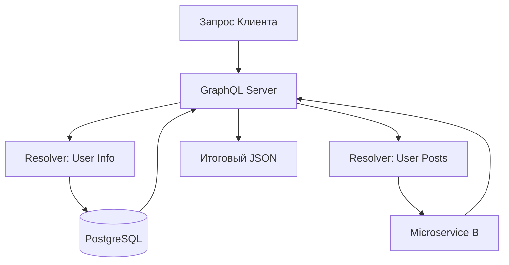

# 🕸️ GraphQL: Язык запросов нового поколения

## 📑 Содержание
1. [Философия GraphQL](#философия)
2. [Типовая Схема (Schema)](#схема)
3. [Резолверы (Resolvers)](#резолверы)
4. [Проблемы REST, которые решает GraphQL](#проблемы-rest)
5. [Когда НЕ стоит использовать](#минусы)

---

## 🧭 Философия

**GraphQL** — это не база данных, это слой между клиентом и источниками данных. Главная идея: **"Клиент заказывает только то, что ему нужно"**.

В отличие от REST, где структура ответа определяется сервером, в GraphQL структуру определяет **клиент**.

---

## 📜 Схема (Schema)

Все данные в GraphQL строго типизированы. Схема описывает, какие объекты существуют и какие поля у них есть.

```graphql
type User {
  id: ID!
  username: String!
  posts: [Post] # Связанный список постов
}

type Query {
  getUser(id: ID!): User
}
```

---

## ⚙️ Резолверы (Resolvers)

Это функции на сервере, которые "добывают" данные для конкретного поля. 

> [!NOTE]
> Самое крутое: резолверы могут брать данные из разных мест. Часть постов может лежать в Postgres, а аватарка пользователя — в S3. Для клиента это выглядит как один запрос.



---

## 🚀 Проблемы REST, которые решает GraphQL

1.  **Overfetching (Избыточность)**: Вы скачиваете весь объект `User` (50 полей), хотя вам нужно только `name`. В мобильных сетях это сильно замедляет работу.
2.  **Underfetching (Недостаточность)**: Чтобы показать экран "Профиль + Список заказов", в REST нужно сделать 2-3 запроса. В GraphQL — это **один** запрос.
3.  **Версионность**: В REST часто приходится плодить `/v1/`, `/v2/`. В GraphQL поля просто помечаются как `deprecated`, а новые добавляются без боли для старых клиентов.

---

## ⚠️ Когда НЕ стоит использовать GraphQL

- **Простые CRUD**: Если у вас всего 2 таблицы, GraphQL добавит только лишнюю сложность.
- **Кэширование**: В REST можно кэшировать по URL. В GraphQL URL всегда один (`/graphql`), поэтому кэшировать ответы сложнее (нужны специальные клиенты типа Apollo или Relay).
- **Безопасность**: Злоумышленник может написать запрос с огромной вложенностью: `user { posts { author { posts { author ... } } } }`, что положит сервер. Нужно внедрять "оценку стоимости запроса" (Query Complexity).

---

> [!IMPORTANT]
> GraphQL — это про **эффективность фронтенда**. Если у вас сложный UI с множеством связей — это ваш выбор. 📱💻🛡️
