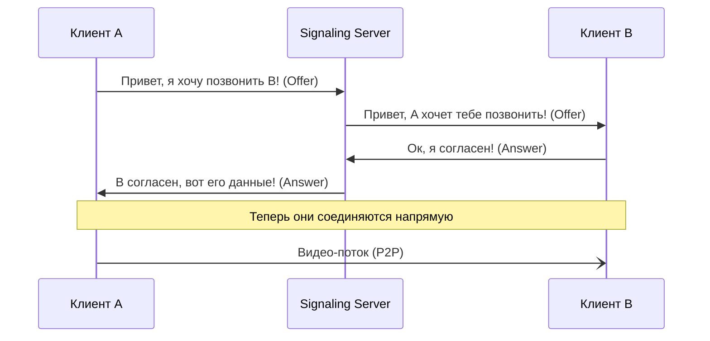

# 📞 WebRTC: Общение в реальном времени

## 📑 Содержание
1. [Что такое WebRTC?](#что-такое-webrtc)
2. [Peer-to-Peer (P2P)](#peer-to-peer-p2p)
3. [Как устанавливается связь (Signaling)](#сигналинг)
4. [STUN и TURN серверы](#stun-и-turn)

---

## ❓ Что такое WebRTC?

**WebRTC (Web Real-Time Communication)** — это технология, которая позволяет браузерам и мобильным приложениям передавать аудио, видео и данные напрямую друг другу без участия сервера. 🎥💬

Используется в Zoom (web-версия), Discord, Google Meet и браузерных играх.

---

## 🤝 Peer-to-Peer (P2P)

В обычной сети данные идут: `Клиент A -> Сервер -> Клиент B`.
В WebRTC данные идут: **`Клиент A -> Клиент B`**.

Это снижает нагрузку на сервер и убирает задержку (пинг), так как путь сообщения короче.

---

## 🗺️ Как устанавливается связь (Signaling)

Хотя данные идут напрямую, клиентам нужно как-то "найти" друг друга. Для этого нужен промежуточный этап — **Сигналинг**.

---

## 🧱 Преграды: STUN и TURN

Большинство компьютеров находятся за NAT (домашним роутером). Они не знают своего внешнего IP адреса.

1.  **STUN сервер**: Помогает клиенту узнать свой публичный IP. "Как меня видят снаружи?". 🌍
2.  **TURN сервер**: Если NAT слишком строгий и прямое P2P соединение невозможно, данные идут через TURN как через "посредника". Это медленнее, но гарантирует связь.

---

> [!IMPORTANT]
> WebRTC работает по протоколу **UDP**, а не TCP. Это значит, что если пара кадров видео потеряется — ничего страшного, зато связь будет мгновенной, без "заиканий" при ожидании потерянных пакетов. ⚡
