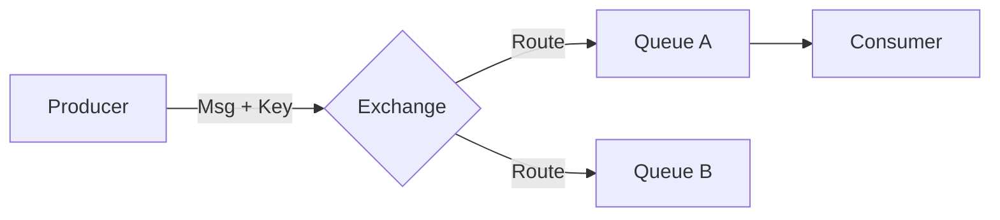

# 📬 Протоколы очередей: AMQP и MQTT

## 📑 Содержание
1. [Зачем нужны очереди?](#зачем-нужны-очереди)
2. [AMQP: Тяжелая артиллерия (RabbitMQ)](#amqp)
3. [MQTT: Для "умных" вещей (IoT)](#mqtt)
4. [Сравнение и выбор](#сравнение)

---

## ❓ Зачем нужны очереди?

Представьте, что при регистрации юзера вам нужно отправить Email. Если это делать прямо в коде — юзер будет ждать, пока отправится почта. 
**Решение**: Положить задачу "Отправить Email" в очередь и сразу ответить юзеру "Успех!". Специальный сервис (воркер) потом заберет задачу и выполнит её. 📥

---

## 🐰 AMQP (Advanced Message Queuing Protocol)

Это основной протокол для **RabbitMQ**. Он сложный, надежный и гибкий. 🛡️

**Ключевые понятия:**
- **Producer**: Тот, кто создает сообщение.
- **Exchange (Обменник)**: "Почтальон". Решает, в какую именно очередь отправить письмо по хитрым правилам.
- **Queue (Очередь)**: Место хранения.
- **Consumer**: Тот, кто читает и обрабатывает.

---

## 📡 MQTT (Message Queuing Telemetry Transport)

Легковесный протокол для условий с плохим интернетом и слабым железом. Стандарт для **IoT** (умных домов, датчиков). 💡

- **Минимальный оверхед**: Заголовки сообщений весят всего пару байт.
- **Pub/Sub модель**: Датчик температуры "публикует" данные, а приложение "подписывается" на них.
- **Broker**: Центральный узел, который всех соединяет (например, Mosquitto).

---

## 📊 Сравнение

| Характеристика | AMQP (RabbitMQ) | MQTT |
| :--- | :--- | :--- |
| **Сложность** | Высокая (множество схем) | Низкая (просто и понятно) |
| **Гарантии** | Очень надежно (Ack, Transactions) | Гибко (QoS 0, 1, 2) |
| **Ресурсы** | Требует много памяти | Очень легкий |
| **Сценарий** | Бэкенд, микросервисы | Умный дом, сенсоры, авто |

---

> [!TIP]
> **Что выбрать?**
> - Если вы строите сложную систему заказов в интернет-магазине — берите **AMQP/RabbitMQ**.
> - Если вы делаете ошейник для собаки с GPS или датчик влажности цветов — берите **MQTT**. 🐾💡
