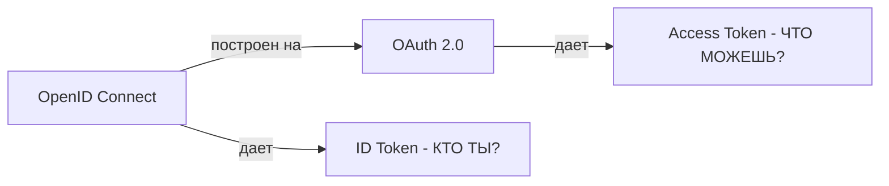
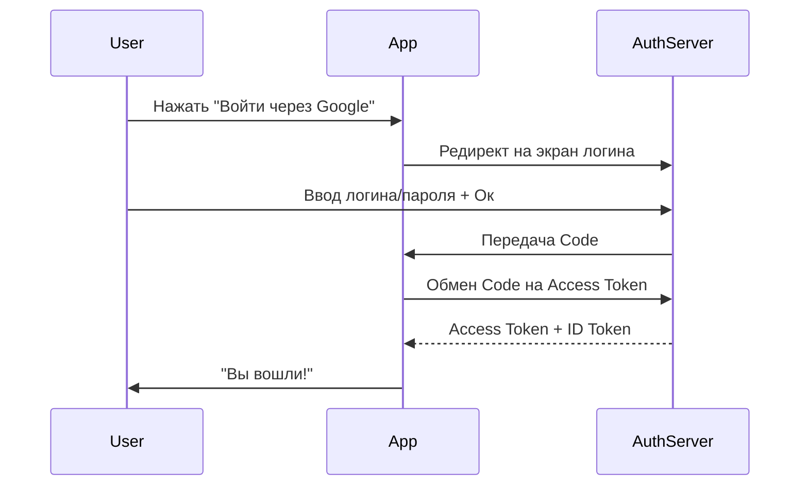

# 🔐 OAuth 2.0 и OpenID Connect: Как работает современная авторизация

## 📑 Содержание
1. [Аутентификация vs Авторизация](#аутентификация-vs-авторизация)
2. [Что такое OAuth 2.0?](#что-такое-oauth-20)
3. [Как работает OpenID Connect (OIDC)?](#что-такое-openid-connect)
4. [Основные роли и потоки (Flows)](#роли-и-потоки)

---

## 🧐 Аутентификация vs Авторизация

Многие путают эти два понятия, но разница критическая:

- **Аутентификация (Authentication/AuthN)**: Ответ на вопрос "Кто вы?". Проверка личности (пароль, отпечаток, SMS-код).
- **Авторизация (Authorization/AuthZ)**: Ответ на вопрос "Что вам разрешено?". Проверка прав доступа к ресурсам.

> [!TIP]
> **Пример из жизни**: Паспорт — это аутентификация. Виза в паспорте — это авторизация (право на въезд).

---

## 🔑 Что такое OAuth 2.0?

**OAuth 2.0** — это протокол **авторизации**. Он позволяет одному приложению (например, Spotify) получить доступ к данным другого приложения (например, Facebook) без передачи пароля пользователя. 🤝

Вместо пароля используется **Access Token**.

---

## 🆔 Что такое OpenID Connect (OIDC)?

**OpenID Connect** — это слой **аутентификации** поверх OAuth 2.0. 
OAuth дает "ключ от двери" (Access Token), а OIDC дает "бейдж сотрудника" (**ID Token**), в котором написано, кто вы такой.

---

## 🔄 Роли и основные потоки (Flows)

### Роли:
1.  **Resource Owner**: Пользователь (Вы).
2.  **Client**: Приложение, которое хочет доступ (LinkedIn).
3.  **Authorization Server**: Сервер, который выдает токены (Google, GitHub).
4.  **Resource Server**: Сервер с данными (API почты, фото).

### Поток Authorization Code (самый частый):
1.  Клиент перенаправляет пользователя на сервер авторизации.
2.  Пользователь логинится и дает добро.
3.  Сервер возвращает **Code** (код).
4.  Клиент меняет **Code** на **Access Token** (в надежном бэкенд-канале).

---

> [!IMPORTANT]
> Никогда не изобретайте свой протокол авторизации. Используйте проверенные библиотеки и провайдеров (Keycloak, Auth0, Google Identity), так как ошибки в безопасности стоят слишком дорого. 🛡️
