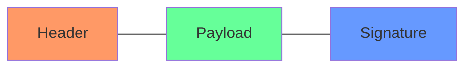
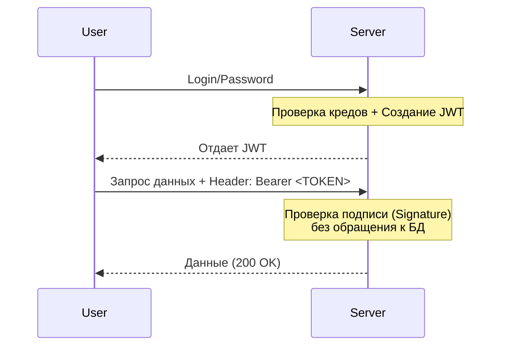

# 📄 JWT (JSON Web Tokens): Паспорт для вашего API

## 📑 Содержание
1. [Что такое JWT?](#что-такое-jwt)
2. [Анатомия токена (Header, Payload, Signature)](#анатомия-токена)
3. [Как это работает под капотом](#как-это-работает)
4. [Безопасность и хранение](#безопасность-и-хранение)

---

## ❓ Что такое JWT?

**JWT (JSON Web Token)** — это открытый стандарт для передачи информации между сторонами в виде объекта JSON. Эта информация считается **достоверной**, так как она подписана цифровой подписью. 🛡️

Обычно используется для авторизации: после логина сервер выдает пользователю JWT, который тот прикрепляет к каждому следующему запросу.

---

## 🦴 Анатомия токена

JWT состоит из трех частей, разделенных точками: `header.payload.signature`

1.  **Header (Заголовок)**: Тип токена (JWT) и алгоритм шифрования (например, HS256 или RS256).
2.  **Payload (Полезная нагрузка)**: Сами данные (Claims). Например: `id` пользователя, `role`, `exp` (время истечения).
3.  **Signature (Подпись)**: Подтверждение, что токен не был изменен. Она создается из закодированного заголовка, полезной нагрузки и секретного ключа сервера.

---

## ⚙️ Как это работает

В отличие от сессий, JWT — это **Stateless** (без сохранения состояния на сервере) механизм.

---

## 🛡️ Безопасность и хранение

### Где хранить на фронтенде?
- **LocalStorage**: 🔴 Опасно (уязвимо к XSS).
- **HttpOnly Cookie**: 🟢 Безопасно (браузер сам шлет куки, JS не имеет к ним доступа).

### Важные советы:
- **Никогда** не храните пароли или секреты внутри Payload. Его может прочитать любой, просто декодировав Base64.
- **Срок жизни (exp)**: Делайте его коротким (например, 15 минут). Для долгого доступа используйте **Refresh Token**.
- **Алгоритмы**: Используйте `RS256` (асимметричный ключ), если у вас много микросервисов, чтобы они могли проверять токен публичным ключом, не зная приватного.

---

> [!CAUTION]
> Если ваш секретный ключ для подписи (secret) утечет, злоумышленники смогут создавать любые токены и заходить под любым пользователем. Берегите ключ! 🗝️
