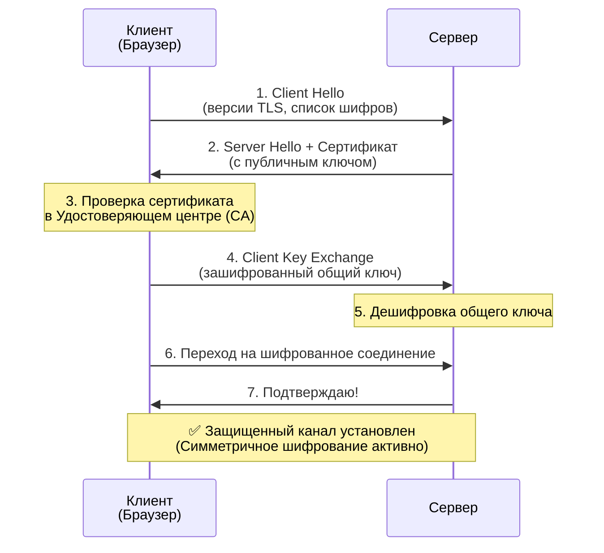
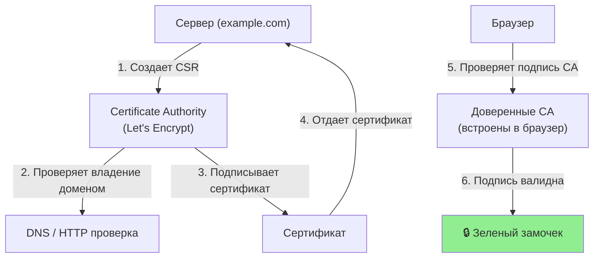

# 🌐 TLS/SSL: Защита данных в пути

## 📑 Содержание
1. [Что такое TLS и зачем он нужен?](#что-такое-tls)
2. [Как работает шифрование (Симметричное vs Асимметричное)](#шифрование)
3. [TLS Handshake (Рукопожатие)](#tls-handshake)
4. [Цифровые сертификаты (CA)](#сертификаты)
5. [Реализация на Go](#реализация-на-go)

---

## ❓ Что такое TLS и зачем он нужен?

**TLS (Transport Layer Security)** — это протокол, который обеспечивает безопасность данных, передаваемых между клиентом (браузером) и сервером. Его предшественником был **SSL**, но сегодня название SSL часто используют по привычке для обозначения TLS. 🛡️

Он решает три задачи:
1.  **Шифрование**: Данные нельзя прочитать при перехвате.
2.  **Аутентификация**: Вы уверены, что общаетесь именно с тем сервером, с которым хотели.
3.  **Целостность**: Данные не были изменены в процессе передачи.

### Зачем это важно?

**Без TLS (HTTP):**
- Пароли передаются открытым текстом
- Любой в сети Wi-Fi может читать ваш трафик
- Злоумышленник может изменить данные (Man-in-the-Middle attack)

**С TLS (HTTPS):**
- Всё зашифровано
- Только вы и сервер знаете содержимое
- Зеленый замочек в браузере ✅

---

## 🔑 Шифрование

TLS использует оба вида шифрования для максимальной эффективности:

### 1. Асимметричное (Публичный + Приватный ключи)

Используется только в самом начале, чтобы безопасно договориться о секретном ключе. Это медленно, но безопасно.

**Как работает:**
- У сервера есть пара ключей: публичный (всем виден) и приватный (секретный)
- Клиент шифрует данные публичным ключом
- Только сервер может расшифровать (приватным ключом)

### 2. Симметричное (Один общий ключ)

Используется для передачи основных данных. Это очень быстро. ⚡

**Как работает:**
- Один и тот же ключ для шифрования и расшифровки
- Оба (клиент и сервер) знают этот ключ
- В 1000 раз быстрее асимметричного

| Тип | Скорость | Безопасность передачи ключа | Применение в TLS |
|:---|:---:|:---:|:---|
| **Асимметричное** | 🐢 Медленно | ✅ Безопасно | Начало соединения |
| **Симметричное** | 🚀 Быстро | ❌ Небезопасно | Основная передача данных |

---

## 🤝 TLS Handshake (Рукопожатие)

Это процесс "знакомства" клиента и сервера перед началом передачи данных:



### Детали шагов:

1. **Client Hello**: Клиент говорит "Я поддерживаю TLS 1.3, вот мои варианты шифрования"
2. **Server Hello**: Сервер выбирает лучший вариант и отправляет свой сертификат
3. **Проверка сертификата**: Клиент проверяет, что сертификат подписан доверенным CA (Let's Encrypt, DigiCert)
4. **Key Exchange**: Клиент генерирует случайный ключ, шифрует его публичным ключом сервера и отправляет
5. **Готово**: Оба знают общий секретный ключ, переключаются на быстрое симметричное шифрование

---

## 📜 Цифровые сертификаты (CA)

Чтобы понять, что сервер `google.com` это действительно Google, используются **Центры Сертификации (Certificate Authorities)**. 

### Как это работает:

1. Google создает пару ключей (публичный + приватный)
2. Google просит **Let's Encrypt** (CA) подписать его сертификат
3. Let's Encrypt проверяет, что Google действительно владеет доменом
4. Let's Encrypt подписывает сертификат своим приватным ключом
5. Ваш браузер доверяет Let's Encrypt (список доверенных CA встроен в браузер)
6. Браузер проверяет подпись — если всё ОК, показывает замочек ✅



---

## 💻 Реализация на Go

### 1. HTTPS сервер с TLS

```go
package main

import (
    "fmt"
    "log"
    "net/http"
)

func handler(w http.ResponseWriter, r *http.Request) {
    fmt.Fprintf(w, "Secure Hello from HTTPS server!")
}

func main() {
    http.HandleFunc("/", handler)
    
    // Запуск HTTPS сервера
    // Нужны два файла: server.crt (сертификат) и server.key (приватный ключ)
    log.Println("Starting HTTPS server on :443")
    err := http.ListenAndServeTLS(":443", "server.crt", "server.key", nil)
    if err != nil {
        log.Fatal("ListenAndServeTLS: ", err)
    }
}
```

---

### 2. Генерация самоподписанного сертификата (для тестирования)

```bash
# Генерируем приватный ключ
openssl genrsa -out server.key 2048

# Создаем сертификат (самоподписанный, для dev)
openssl req -new -x509 -key server.key -out server.crt -days 365
```

> [!WARNING]
> Самоподписанные сертификаты подходят только для разработки! В продакшене используйте **Let's Encrypt**.

---

### 3. Настройка TLS конфигурации

```go
import (
    "crypto/tls"
    "net/http"
)

func main() {
    // Настройка TLS
    tlsConfig := &tls.Config{
        MinVersion: tls.VersionTLS13,  // Минимум TLS 1.3
        CipherSuites: []uint16{
            tls.TLS_ECDHE_RSA_WITH_AES_256_GCM_SHA384,
            tls.TLS_ECDHE_RSA_WITH_AES_128_GCM_SHA256,
        },
    }
    
    server := &http.Server{
        Addr:      ":443",
        Handler:   nil,
        TLSConfig: tlsConfig,
    }
    
    log.Fatal(server.ListenAndServeTLS("server.crt", "server.key"))
}
```

---

### 4. TLS клиент (проверка сертификата)

```go
import (
    "crypto/tls"
    "crypto/x509"
    "io/ioutil"
    "net/http"
)

func makeSecureRequest() error {
    // Загружаем корневые сертификаты CA
    caCert, err := ioutil.ReadFile("ca.crt")
    if err != nil {
        return err
    }
    
    caCertPool := x509.NewCertPool()
    caCertPool.AppendCertsFromPEM(caCert)
    
    // Настройка TLS для клиента
    tlsConfig := &tls.Config{
        RootCAs: caCertPool,
        MinVersion: tls.VersionTLS12,
    }
    
    client := &http.Client{
        Transport: &http.Transport{
            TLSClientConfig: tlsConfig,
        },
    }
    
    resp, err := client.Get("https://example.com")
    if err != nil {
        return err
    }
    defer resp.Body.Close()
    
    // Проверяем сертификат
    if resp.TLS != nil {
        fmt.Println("TLS Version:", resp.TLS.Version)
        fmt.Println("Cipher Suite:", resp.TLS.CipherSuite)
        fmt.Println("Server Name:", resp.TLS.ServerName)
    }
    
    return nil
}
```

---

### 5. Let's Encrypt с автоматическим обновлением

```go
import (
    "golang.org/x/crypto/acme/autocert"
    "net/http"
)

func main() {
    // Автоматическое получение и обновление SSL сертификатов от Let's Encrypt
    certManager := autocert.Manager{
        Prompt:     autocert.AcceptTOS,
        HostPolicy: autocert.HostWhitelist("example.com", "www.example.com"),
        Cache:      autocert.DirCache("certs"), // Папка для хранения сертификатов
    }
    
    server := &http.Server{
        Addr: ":443",
        TLSConfig: &tls.Config{
            GetCertificate: certManager.GetCertificate,
        },
    }
    
    // Также нужен HTTP сервер на :80 для ACME challenge
    go http.ListenAndServe(":80", certManager.HTTPHandler(nil))
    
    log.Fatal(server.ListenAndServeTLS("", ""))
}
```

---

## 🛡️ Безопасность и лучшие практики

### ✅ Что делать:

1. **Используйте TLS 1.3** (или минимум 1.2)
2. **Автообновление сертификатов** (Let's Encrypt + autocert)
3. **HSTS заголовок**: Браузер будет всегда использовать HTTPS
   ```go
   w.Header().Set("Strict-Transport-Security", "max-age=31536000; includeSubDomains")
   ```
4. **Отключите старые алгоритмы**: Никаких RC4, MD5, SHA1

### ❌ Чего НЕ делать:

1. **Не игнорируйте ошибки сертификатов**
   ```go
   // ❌ ПЛОХО: отключает проверку сертификатов!
   tlsConfig := &tls.Config{
       InsecureSkipVerify: true,
   }
   ```

2. **Не используйте HTTP для чувствительных данных**
3. **Не перемещайте приватные ключи по email/Slack**

---

## 💡 Итог

| Концепция | Описание | Применение |
|:---|:---|:---|
| **TLS/SSL** | Шифрование трафика | Защита от прослушки |
| **Handshake** | Обмен ключами | Начало сессии |
| **Сертификат** | Подтверждение личности | Избежать MITM |
| **CA** | Удостоверяющий центр | Let's Encrypt, DigiCert |
| **Асимметричное** | Медленное, безопасное | Обмен ключом |
| **Симметричноеfast**, быстрое | Передача данных |

> [!CAUTION]
> Никогда не игнорируйте предупреждения браузера "Соединение не защищено". Это может означать, что кто-то пытается перехватить ваш трафик (атака Man-in-the-Middle). ⚠️
