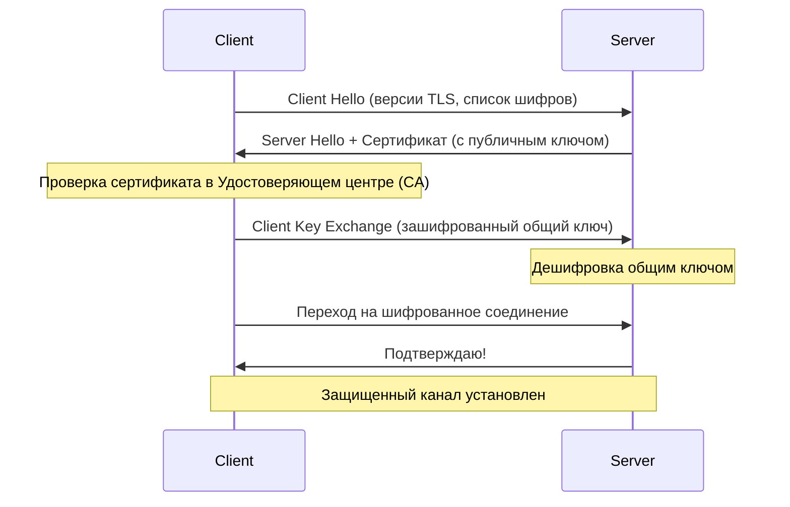

# 🌐 TLS/SSL: Защита данных в пути

## 📑 Содержание
1. [Что такое TLS и зачем он нужен?](#что-такое-tls)
2. [Как работает шифрование (Симметричное vs Асимметричное)](#шифрование)
3. [TLS Handshake (Рукопожатие)](#tls-handshake)
4. [Цифровые сертификаты (CA)](#сертификаты)

---

## ❓ Что такое TLS и зачем он нужен?

**TLS (Transport Layer Security)** — это протокол, который обеспечивает безопасность данных, передаваемых между клиентом (браузером) и сервером. Его предшественником был **SSL**, но сегодня название SSL часто используют по привычке для обозначения TLS. 🛡️

Он решает три задачи:
1.  **Шифрование**: Данные нельзя прочитать при перехвате.
2.  **Аутентификация**: Вы уверены, что общаетесь именно с тем сервером, с которым хотели.
3.  **Целостность**: Данные не были изменены в процессе передачи.

---

## 🔑 Шифрование

TLS использует оба вида шифрования для максимальной эффективности:

- **Асимметричное (Публичный + Приватный ключи)**: Используется только в самом начале, чтобы безопасно договориться о секретном ключе. Это медленно, но безопасно.
- **Симметричное (Один общий ключ)**: Используется для передачи основных данных. Это очень быстро. ⚡

---

## 🤝 TLS Handshake (Рукопожатие)

Это процесс "знакомства" клиента и сервера перед началом передачи данных:

---

## 📜 Цифровые сертификаты (CA)

Чтобы понять, что сервер `google.com` это действительно Google, используются **Центры Сертификации (Certificate Authorities)**. 

1. Сервер отправляет вам сертификат.
2. Ваш браузер проверяет подпись этого сертификата у доверенного центра (например, Let's Encrypt).
3. Если подпись верна — соединение считается безопасным. ✅

---

> [!CAUTION]
> Никогда не игнорируйте предупреждения браузера "Соединение не защищено". Это может означать, что кто-то пытается перехватить ваш трафик (атака Man-in-the-Middle). ⚠️
