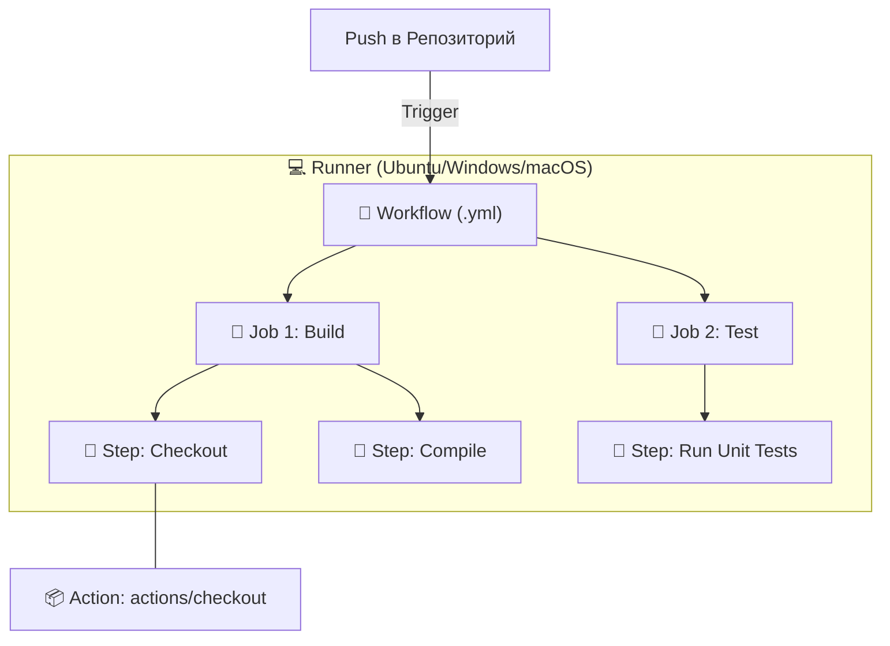

# 🤖 GitHub Actions: Автоматизация в репозитории

## 📑 Содержание
1. [Что это такое?](#что-такое-github-actions)
2. [Основные понятия](#основные-понятия)
3. [Как это работает (Схема)](#как-это-работает-схема)
4. [Пример YAML файла](#пример-простого-pipeline)
5. [Советы](#полезные-советы-для-начинающих)

---

## ❓ Что такое GitHub Actions?

**GitHub Actions** — это встроенный в GitHub инструмент для реализации CI/CD. Он позволяет автоматизировать любые задачи разработки (сборку, тестирование, деплой) прямо там, где лежит ваш код. 🏗️

Вам не нужно настраивать отдельные серверы (как для Jenkins), всё работает в облаке GitHub.

---

## 🧩 Основные понятия

Чтобы понять, как всё устроено, представьте матрешку:

1.  **🚀 Workflow (Воркфлоу)**: Весь процесс автоматизации. Обычный `.yml` файл.
2.  **🔔 Event (Событие)**: Триггер, который запускает процесс (например, `push` или `pull_request`).
3.  **💼 Job (Работа)**: Набор шагов, выполняемых на одном сервере.
4.  **👣 Step (Шаг)**: Конкретная команда или действие.
5.  **📦 Action (Экшен)**: Готовый "кирпичик" (например, `actions/checkout`).
6.  **🖥️ Runner (Раннер)**: Виртуальная машина, на которой выполняется код.

---

## 🗺️ Как это работает (Схема)



---

## 📝 Пример YAML файла

Файл должен лежать в `.github/workflows/main.yml`:

```yaml
name: CI Pipeline 🚀

on:
  push:
    branches: [ main ]
  pull_request:
    branches: [ main ]

jobs:
  test-and-build:
    runs-on: ubuntu-latest

    steps:
      - name: 📥 Скачиваем код
        uses: actions/checkout@v4

      - name: ⚙️ Настройка окружения
        run: echo "Установка зависимостей..."

      - name: 🧪 Тестирование
        run: echo "Запуск тестов..."

      - name: 📦 Сборка
        run: echo "Сборка приложения..."
```

---

## 💡 Полезные советы

> [!TIP]
> **Для новичков:**
> - **Начинайте постепенно**: Сначала только тесты, деплой потом. 🧪
> - **GitHub Marketplace**: Ищите готовые экшены, не пишите всё с нуля. 🛒
> - **Secrets**: Храните пароли в настройках репозитория (`Settings > Secrets`). 🔑

---

> [!IMPORTANT]
> GitHub Actions чувствителен к **пробелам** в YAML файлах. Один лишний пробел может сломать всё! 📏
