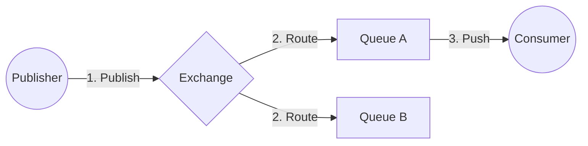
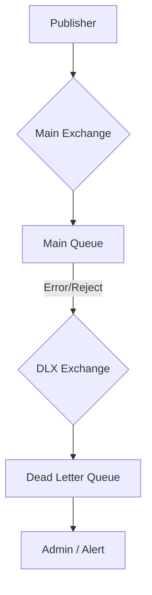

# 🐰 RabbitMQ

## 📑 Содержание
1. [Что это?](#1-что-это)
2. [Как это работает?](#2-как-это-работает)
3. [Гарантии доставки](#3-гарантии-доставки)
4. [Dead Letter Exchange (DLX)](#4-dead-letter-exchange-dlx)

---

## 1. 🤔 Что это?

**RabbitMQ** — это "умный" брокер сообщений. В отличие от Kafka (которая просто хранит лог), RabbitMQ умеет сама маршрутизировать сообщения по сложным правилам.

*   **Протокол**: AMQP 0.9.1.
*   **Стиль**: Smart Broker, Dumb Consumer.

---

## 2. ⚙️ Как это работает?

1.  **Publisher**: Не кладет письмо сразу в ящик. Он отдает его почтальону (**Exchange**).
2.  **Exchange**: Смотрит на адрес (Routing Key) и рассовывает письмо по Очередям (**Queues**).
3.  **Consumer**: Подписан на очередь. Брокер сам проталкивает ему сообщение (**Push**).

---

## 3. 🛡️ Гарантии доставки

RabbitMQ по умолчанию работает быстро, но не надежно. Чтобы получить надежность, нужно включить три механизма:

### 1. Persistence (Стойкость)
*   **Durable Exchange/Queue**: Сама очередь не исчезнет после перезагрузки RabbitMQ.
*   **Persistent Messages**: Сообщения пишутся на диск (`deliveryMode=2`). Иначе они живут только в RAM и пропадут при рестарте.

### 2. Publisher Confirms
Отправитель должен знать, приняла ли RabbitMQ письмо.
*   Включаем `confirmSelect`.
*   Если брокер не прислал `ack` отправителю — отправляем снова.

### 3. Consumer Acknowledgement (Ручной Ack)
Самое важное.
*   **Auto-Ack (default)**: Брокер считает письмо доставленным, как только отправил его в TCP-сокет. Если консьюмер упал во время обработки — письмо потеряно.
*   **Manual-Ack**: Консьюмер говорит "Я обработал" (`basic.ack`) только **после** того, как сохранил данные в БД. Если консьюмер упал без Ack, брокер вернет письмо в очередь другому консьюмеру.

---

## 4. 💀 Dead Letter Exchange (DLX)

Куда девать письма, которые никто не смог обработать?
Если RabbitMQ пытается доставить письмо 10 раз и каждый раз получает ошибку (`basic.nack`), письмо может зациклиться.

**DLX** — это механизм пересылки "мертвых" писем в отдельную очередь.

**Причины смерти письма:**
1.  **Rejected**: Консьюмер сказал `basic.reject(requeue=false)`.
2.  **Expired**: Истек TTL (Time To Live) сообщения.
3.  **MaxLength**: Очередь переполнилась.

Администратор может потом разобрать DLQ и понять, почему письма не обрабатываются (баг в коде, битые данные).