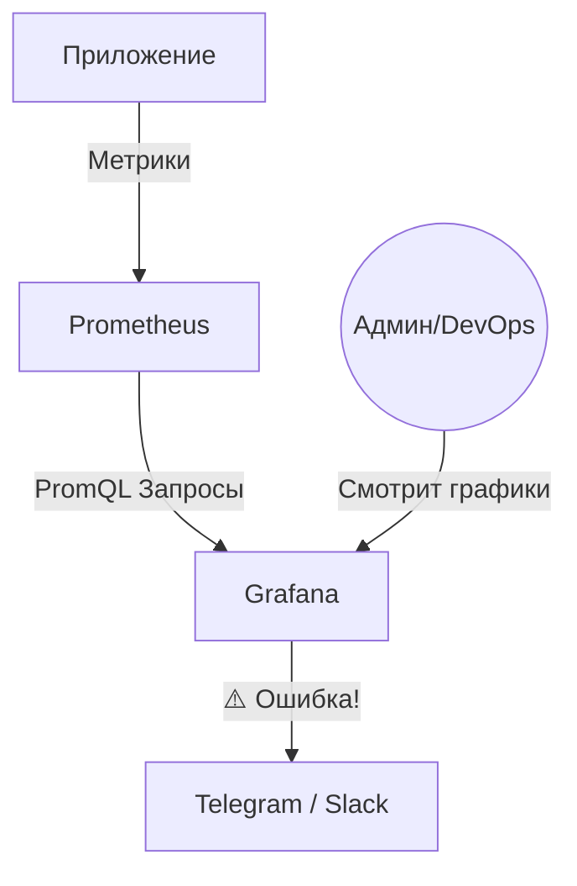

# 🖼️ Grafana: Визуализация данных

## 📑 Содержание
1. [Что такое Grafana?](#что-такое-grafana)
2. [Data Sources (Источники данных)](#источники-данных)
3. [Dashboards (Дашборды)](#дашборды)
4. [Алертинг (Alerting)](#алертинг)
5. [Схема работы связки Prometheus + Grafana](#схема-работы)

---

## ❓ Что такое Grafana?

**Grafana** — это платформа с открытым исходным кодом для визуализации, мониторинга и анализа данных. 💹

Если Prometheus — это "база данных", то Grafana — это "красивый экран", который рисует графики на основе этих данных. Она не хранит данные сама, а лишь отображает их из внешних источников.

---

## 🔌 Источники данных (Data Sources)

Grafana умеет работать почти с чем угодно:
- **Prometheus** (метрики).
- **Elasticsearch** (логи).
- **PostgreSQL / MySQL** (бизнес-данные).
- **Jaeger** (трассировки).
- **CloudWatch / Azure Monitor** (облака).

---

## 📊 Дашборды (Dashboards)

**Дашборд** — это набор панелей (графиков, таблиц, индикаторов), собранных на одном экране.

> [!TIP]
> **Принципы хорошего дашборда:**
> - **Сверху вниз**: Самые важные показатели (статус "жив/мертв", ошибки) должны быть в самом верху.
> - **Простота**: Каждая панель должна отвечать на один конкретный вопрос.
> - **Контекст**: Добавляйте пороги (thresholds). График не просто должен показывать 80%, он должен подсвечиваться красным, если это критично. 🔴

---

## 🔔 Алертинг (Alerting)

Grafana может не только показывать графики, но и кричать о помощи:
1. Вы ставите условие (например: `CPU > 90% больше 5 минут`).
2. Если условие сработало, Grafana отправляет уведомление в **Telegram, Slack, Email или Opsgenie**. ✉️

---

## 🗺️ Схема работы

---

## 🌟 Почему Grafana?

> [!IMPORTANT]
> - **Единое окно**: Можно на одном экране совместить графики из Prometheus и записи из базы данных.
> - **Шаблоны**: Существуют тысячи готовых дашбордов (например, "Node Exporter" для мониторинга серверов), которые можно скачать и импортировать за минуту. 📦
> - **Динамика**: Вы можете использовать переменные (variables), чтобы переключаться между разными серверами или регионами прямо на дашборде.
